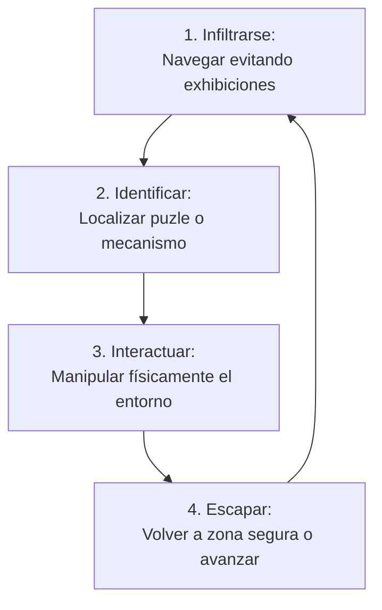
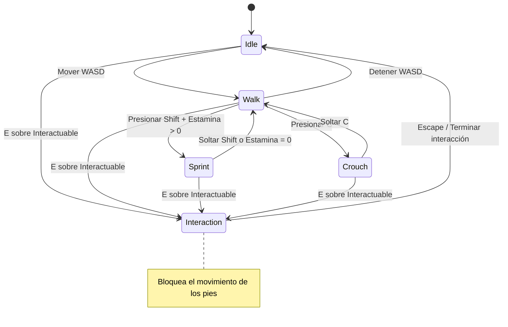
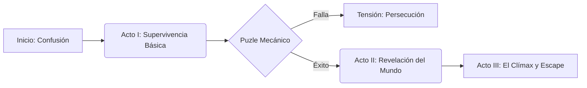
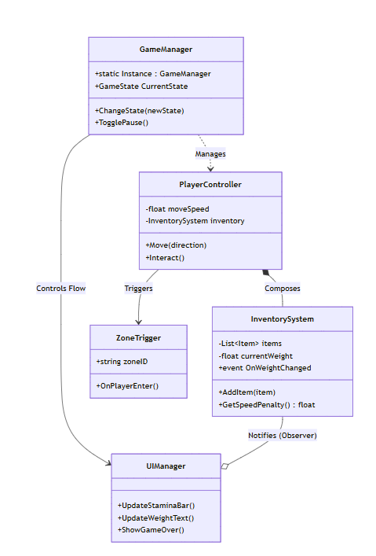

# Documento de Diseño de Juego (GDD) - Museum Lockdown

## 1. Fase 1: Conceptualización y Resumen Ejecutivo
En esta fase se definen las bases creativas y el propósito del proyecto para alinear la visión del equipo antes de comenzar con el diseño técnico detallado.

### 1.1. Ficha Técnica
* **Título Provisional:** *Museum Lockdown: Echoes of the Past*.
* **Género:** Sigilo Táctico / Puzles de Gestión / Supervivencia.
* **Plataforma:** PC (Windows/Mac).
* **Motor de Desarrollo:** Unity.

### 1.2. Elevator Pitch
*Museum Lockdown* es un juego de sigilo y puzles donde **tomas el papel de un visitante atrapado** en un museo cuyas exhibiciones cobran vida tras el cierre. **Debes activar antiguos mecanismos mecánicos** para desbloquear la salida del edificio mientras **navegas entre estatuas romanas que patrullan**, armaduras que escuchan cada paso y esqueletos de dinosaurios que vigilan los pasillos, utilizando solo tu ingenio y el entorno para sobrevivir hasta el amanecer.

### 1.3. La Técnica "X meets Y"
> "Es **Night at the Museum** conoce a **Amnesia: The Dark Descent**: experimentas la maravilla de ver la historia cobrar vida, pero con la vulnerabilidad de un sistema donde el sigilo y la gestión de recursos son tu única defensa".

### 1.4. Unique Selling Points (USP)
Estas características representan los puntos únicos de valor que diferencian al proyecto:

* **USP 1: "Anima-FSM" (IA de Exhibiciones por Eras)**: Cada objeto vivo tiene comportamientos únicos según su origen histórico. Por ejemplo, las armaduras medievales son lentas pero poseen un oído agudo, mientras que las estatuas de mármol solo se desplazan cuando no las estás mirando directamente.
* **USP 2: Sistema de Interacción Mecánica "Diegética"**: Los puzles no se resuelven en menús independientes; son engranajes, palancas y sistemas de espejos físicos que debes manipular manualmente en el mundo 3D para alterar el entorno y abrir caminos.
* **USP 3: Propagación de Ruido Dinámico**: El material del suelo dicta tu seguridad. Correr sobre el mármol de la sala principal genera un eco (radio de ruido) que alerta a las exhibiciones lejanas, obligándote a buscar alfombras o superficies blandas para moverte sin ser detectado.

### 1.5. Especificaciones de Mercado y Producto
* **Público Objetivo**: Jugadores "Hardcore" (edad: 14+) y fans del terror psicológico que disfrutan la gestión de recursos tensa y mecánicas de sigilo sistémico.
* **Razón de Stack (Unity)**: Se selecciona por su capacidad de gráficos de alta fidelidad, gran ecosistema de herramientas y flexibilidad para prototipos complejos en PC.

---

## 2. Planificación Inicial (Sprint 0)

**EPIC 1: Definición del High Concept** **Descripción:** Establecer las bases creativas y comerciales del proyecto para el Product Backlog inicial.

| Tipo | Tarea (User Story / Task) | Descripción / Criterios de Aceptación | Estimación (SP) |
| :--- | :--- | :--- | :--- |
| **Story** | **Definir la Identidad del Juego** | **Como** equipo de diseño, **quiero** establecer el género y el "pitch" **para** que todos tengamos la misma visión.<br><br>**Criterios:**<br>1. Definir título provisional.<br>2. Escribir Elevator Pitch (estilo directo al jugador).<br>3. Definir género principal y subgénero. | 2 |
| **Story** | **Análisis de Referencias** | **Como** diseñador, **quiero** analizar 3 juegos similares **para** identificar qué evitar y qué adoptar.<br><br>**Criterios:**<br>1. Listar 3 competidores directos.<br>2. Adjuntar capturas de pantalla de sus interfaces (UI).<br>3. Crear lista de "Lo bueno" y "Lo malo". | 3 |
| **Story** | **Definir Pilares de Diseño (USPs)** | **Como** productor, **quiero** listar los 3 puntos únicos **para** priorizar el desarrollo de mecánicas futuras.<br><br>**Criterios:**<br>1. Documentar los 3 USPs finales del proyecto.<br>2. Explicar cómo cada USP afecta técnicamente a la arquitectura o al código de Unity. | 3 |
| **Task** | **Configuración de Repositorio y Docs** | Configurar el sistema de control de versiones (Git) y el espacio de documentación centralizada.<br><br>**Criterios:**<br>1. Repositorio Unity configurado con `.gitignore` adecuado.<br>2. Espacio de Wiki o Notion inicializado para el GDD vivo. | 1 |

---

## 3. Fase 2: Mecánicas, Gameplay y Núcleo MDA
En esta fase se definen los códigos y reglas que generan la experiencia interactiva, aplicando el Framework MDA para conectar la tecnología con la emoción.

### 3.1. Aesthetics (Estética - La Experiencia Emocional)
No se refiere al arte visual, sino a la respuesta emocional deseada en el jugador:
* **Descubrimiento:** Explorar salas históricas y revelar mecanismos ocultos.
* **Desafío:** Resolver puzles lógicos bajo la presión constante de ser cazado.
* **Fantasía:** Vivir la experiencia de un museo que cobra vida desde una perspectiva de vulnerabilidad real.
* **Sensación:** Tensión auditiva y visual debido a la escasez de recursos y la fragilidad del personaje.

### 3.2. Dynamics (Dinámicas - El Comportamiento Emergente)
Comportamientos que surgen cuando el jugador interactúa con las mecánicas:
* **Gestión del Riesgo Acústico:** Decisión constante entre velocidad (ruido alto) y seguridad (ruido bajo) según la proximidad de las amenazas.
* **Estrategia de Contacto Visual:** El jugador debe alternar su atención entre navegar el entorno y mantener la vista en estatuas específicas para congelar su avance.
* **Economía de Luz/Ruido:** La necesidad de cargar la linterna manual crea ventanas de vulnerabilidad donde el ruido de la carga puede atraer a enemigos.

### 3.3. Mecánicas Detalladas (Game System Design)
Reglas técnicas, códigos y "verbos" de acción específicos.

#### A. Locomoción y Sigilo (Físicas de Unity)
* **Crouch (Agachado):** Vel: $1.2 m/s$ | Ruido: Radio $0.5m$ | Visibilidad: Baja.
* **Walk (Caminar):** Vel: $3.5 m/s$ | Ruido: Radio $3.0m$ | Visibilidad: Media.
* **Sprint (Carrera):** Vel: $6.0 m/s$ | Ruido: Radio $8.0m$ | Consume barra de estamina en $4.0s$.
* **Inputs:** WASD para movimiento, `C` para agacharse, `Shift` para correr.

#### B. Sistema de Interacción Diegética
* **Manipulación Física:** Uso de *Raycasting* para detectar colisiones con engranajes o palancas a una distancia $< 1.5m$.
* **Grab & Rotate:** Al mantener `E`, el desplazamiento del ratón se vincula directamente al eje de rotación del objeto físico, permitiendo una manipulación táctil del entorno.

#### C. IA de Exhibiciones (Anima-FSM)
* **Detección Visual:** Cono de visión de $90^{\circ}$ con un tiempo de alerta de $1.5s$.
* **Detección Auditiva:** Si el `NoiseRadius` del jugador interseca con el rango de escucha de la IA, esta se desplaza a investigar el origen del sonido.

### 3.4. Diagramas de Diseño

#### Diagrama de Flujo: Core Loop


#### Máquina de Estados del Jugador (Player FSM)



## 3.5. Planificación del Sprint 1 (Backlog Parte 2)

**EPIC 2: Core Gameplay Mechanics** **Descripción:** Implementación de las "3 Cs" (Character, Camera, Controls) y sistemas de sigilo sistémico.

| Tipo | Tarea (User Story) | Detalles Técnicos / Criterios de Aceptación | Estimación (SP) |
| :--- | :--- | :--- | :--- |
| **Story** | **Controlador de Locomoción** | **Como** jugador, **quiero** mover a mi personaje con WASD **para** explorar el museo tácticamente.<br><br>**Criterios:**<br>1. Implementar físicas con Rigidbody.<br>2. Mapear inputs de teclado.<br>3. Configurar colisiones para no atravesar muros. | 5 |
| **Story** | **Sistema de Sigilo (Ruido)** | **Como** diseñador, **quiero** que la velocidad afecte el radio de detección **para** crear tensión.<br><br>**Criterios:**<br>1. Crear variable dinámica `NoiseRadius`.<br>2. Implementar Gizmo visual (círculo) en modo debug que cambie según la velocidad.<br>3. Estado "Agachado" reduce el radio un $80\%$. | 8 |
| **Task** | **Cámara en Primera Persona** | Configurar una cámara que siga al jugador con suavizado y colisión con muros.<br><br>**Criterios:**<br>1. Implementar rotación suave (*Smooth Damp*).<br>2. Ajustar el cabeceo de cámara (*Head Bob*) al caminar. | 3 |
| **Story** | **Interacción Mecánica Base** | **Como** jugador, **quiero** manipular palancas y engranajes **para** resolver puzles ambientales.<br><br>**Criterios:**<br>1. Sistema de Raycast para detectar objetos interactuables.<br>2. Vincular el mouse delta con la rotación física del objeto.<br>3. Feedback visual (UI) al apuntar a un objeto interactuable. | 8 |

---

## 4. Dinámicas, Sistemas y Economía de Juego
Esta sección detalla las estructuras de datos y el balance numérico que generan las Dinámicas (la "D" de MDA) a partir de las reglas del sistema.

### 4.1. Diseño de Sistemas (The Systems Design)
Un sistema es un conjunto de reglas que gestionan valores numéricos complejos para forzar decisiones en el jugador.

#### A. Sistema de Carga e Inercia (Encumbrance System)
El inventario no es infinito; se basa en el peso físico de los objetos recolectados (engranajes de bronce, lentes ópticas, herramientas).

**Regla de Diseño:** El peso total afecta directamente a la física del jugador.

**Dinámica de Riesgo:** A mayor carga, menor velocidad y mayor radio de ruido al caminar. El jugador debe decidir: "¿Llevo esta pieza pesada ahora arriesgándome a que me escuchen, o hago dos viajes?".

#### B. Sistema de Flujo de Energía (Energy Sink)
Gestiona la supervivencia básica a través de la luz de la linterna de dinamo.

* **Fuentes (Sources):** Recarga manual mediante la manivela (genera ruido alto).
* **Sumideros (Sinks):** Consumo pasivo por segundo (descarga de batería).
* **Estado de Fallo:** Si la energía llega a cero, el jugador queda en oscuridad total, aumentando drásticamente la velocidad de detección de las exhibiciones.

### 4.2. Implementación Técnica (Unity/C#)
En esta sección, transformamos las reglas de diseño en estructuras de datos y lógica de negocio. Se utiliza una arquitectura basada en Composición para evitar la herencia profunda y facilitar el mantenimiento.

#### A. Patrón de Diseño: Observador (Observer Pattern)
Implementaremos este patrón para que el InventorySystem notifique automáticamente a otros componentes (como la UI de batería o el controlador de movimiento) cuando ocurra un cambio en los recursos.

**Ventaja:** El sistema de inventario no necesita saber si existe una UI o un jugador; simplemente emite un evento al que otros se suscriben.

#### B. Estructura de Código (Backend de Sistemas)
A continuación, se define el modelo de datos y el gestor de lógica adaptado a Unity, basado en los ejemplos de la guía técnica.

##### 1. Data Model: El Ítem
```csharp
[System.Serializable]
public class Item {
    public string id;
    public string name;
    public float weight; // Peso en kg
    public float energyValue; // Valor de carga para linterna
}
```

##### 2. Business Logic: InventorySystem.cs
```csharp
using UnityEngine;
using System;
using System.Collections.Generic;

public class InventorySystem : MonoBehaviour {
    [SerializeField] private float MAX_WEIGHT = 30.0f; // Límite definido en el GDD
    private float _currentWeight = 0;
    private List<Item> _items = new List<Item>();

    // Observables: Eventos a los que la UI y el Jugador se suscribirán
    public event Action<float> OnWeightChanged;
    public event Action OnInventoryFull;

    public bool AddItem(Item item) {
        if (_currentWeight + item.weight > MAX_WEIGHT) {
            OnInventoryFull?.Invoke(); // Notificar error de peso
            return false;
        }
        _items.Add(item);
        _currentWeight += item.weight;
        OnWeightChanged?.Invoke(_currentWeight); // Notificar cambio
        return true;
    }

    public float GetMovementPenalty() {
        // Cálculo de penalización de 0.0 a 0.8 (80% de lentitud máx)
        float percentage = _currentWeight / MAX_WEIGHT;
        return Mathf.Clamp(percentage, 0, 0.8f); 
    }
}
```

##### 3. Integración: PlayerController.cs
```csharp
public class PlayerController : MonoBehaviour {
    [SerializeField] private float baseSpeed = 5.0f;
    private InventorySystem inventory;

    void Start() {
        inventory = GetComponent<InventorySystem>();
        // Suscripción al observador para feedback o logs
        inventory.OnWeightChanged += (newWeight) => {
            Debug.Log($"Carga actual: {newWeight}kg");
        };
    }

    void Update() {
        // En cada frame calculamos la velocidad real según el sistema
        float penalty = inventory.GetMovementPenalty();
        float currentSpeed = baseSpeed * (1 - penalty);
        
        // Aplicar movimiento...
    }
}
```

### 4.3. Base de Datos de Ítems (JSON)
Siguiendo las mejores prácticas, los datos de los ítems se mantienen en un archivo externo para facilitar el balanceo sin tocar el código.

```json
[
  { 
    "id": "heavy_gear", 
    "name": "Engranaje de Bronce", 
    "weight": 12.5, 
    "type": "puzzle_part" 
  },
  { 
    "id": "dynamo_oil", 
    "name": "Aceite Sintético", 
    "weight": 0.5, 
    "energyValue": 25.0,
    "type": "consumable" 
  }
]
```

---

## 4.4. Planificación del Sprint 2 (Backlog Parte 3 Actualizado)

**EPIC 3: Sistemas de Inventario y Economía** **Descripción:** Implementación de la lógica de datos y persistencia.

| Tipo | Tarea (User Story) | Detalles Técnicos / Criterios de Aceptación | Estimación (SP) |
| :--- | :--- | :--- | :--- |
| **Story** | **Lógica de Inventario (Backend)** | **Como** sistema, **quiero** gestionar pesos e ítems **para** limitar al jugador.<br><br>**Tech:** Clase C# pura. Unit Tests requeridos. | 5 |
| **Story** | **Penalización por Peso** | **Como** diseñador, **quiero** que el peso reduzca la velocidad **para** crear riesgo/recompensa.<br><br>**Tech:** Conectar InventorySystem con PlayerController. | 3 |
| **Story** | **Loot Spawning** | **Como** sistema, **quiero** instanciar ítems (Mesh) recolectables en el mundo.<br><br>**Tech:** Triggers que llamen a addItem(). | 8 |

---

## 5. Fase 4: Narrativa, Mundo y Diseño de Niveles

### 5.1. Premisa General: "La Paradoja del Conservador"
El Museo no es solo un edificio; es un nexo cronológico donde el tiempo se ha fracturado. Al caer la noche, el "Silencio Primordial" permite que las exhibiciones recuperen su esencia física. El jugador no es un héroe, es un intruso en el tiempo que debe navegar por las cicatrices de la historia para escapar antes de que su propia existencia sea "catalogada" y convertida en una estatua más.

### 5.2. Arcos y Personajes Principales
La narrativa se centra en la evolución temática del aislamiento y la observación.

* **El Protagonista (Elías):** Un técnico de mantenimiento pragmático que no cree en leyendas. Su arco es de la negación al asombro terrorífico.
* **El Antagonista (El Conservador de Sombras):** Una presencia incorpórea que se comunica a través de los altavoces del museo. Representa la obsesión por preservar el pasado a cualquier costo.
* **Las Exhibiciones (Las Entidades):** No son monstruos, son ecos con propósito. Las armaduras medievales buscan "intrusos" para proteger el tesoro; los bustos romanos vigilan con la frialdad de los senadores.

### 5.3. Estructura Narrativa: Los Tres Actos del Encierro
Utilizamos una curva de dificultad escalada mapeada a la progresión del mundo.

#### Acto I: El Despertar del Bronce
* **Bioma:** Galería de Historia Antigua (Mármol y Eco).
* **Conflicto:** Elías queda atrapado y descubre que las sombras tienen masa física.
* **Objetivo:** Activar el sistema de emergencia mientras se aprende que la luz es el único repelente.

#### Acto II: El Corazón Mecánico
* **Bioma:** Sala de Relojería y Revolución Industrial (Engranajes y Vapor).
* **Conflicto:** El museo se reconfigura físicamente. Los puzles requieren piezas pesadas que penalizan el movimiento.
* **Objetivo:** Sincronizar el "Reloj Maestro" para abrir las alas restringidas.

#### Acto III: La Extinción Digital
* **Bioma:** Ala de Prehistoria y Tecnología Futura (Fósiles y Neón).
* **Conflicto:** Los depredadores más antiguos (esqueletos de dinosaurios) usan la audición dinámica para cazar.
* **Objetivo:** Llegar a la salida principal antes de que el "Ciclo de Catalogación" (amanecer) se complete.

### 5.4. Temas Narrativos y Worldbuilding Ambiental
El escenario cuenta la historia a través de la técnica del Environmental Storytelling.

* **El Peso de la Historia:** Cuantos más objetos recolecta el jugador, más lento se vuelve, simbolizando cómo el pasado nos ancla.
* **La Fragilidad del Presente:** Los humanos son vistos como "efímeros" frente a las estatuas eternas.
* **Pistas Visuales:** Notas de guardias anteriores pegadas en las vitrinas: "Si escuchas metal arrastrándose, no corras... el mármol amplifica el miedo".
* **Barks (Diálogos de Sistema):** Frases cortas de Elías que refuerzan la inmersión:
  - Al entrar en una zona oscura: "Mis manos tiemblan... necesito cargar la dinamo".
  - Al ver una estatua moverse: "Juro que antes estaba mirando hacia el otro lado".

### 5.5. Diagrama de Flujo: Progresión Narrativa


### 5.6. Diseño del Nivel 1: "El Ala de los Césares"
Estructuramos el nivel siguiendo el modelo de flujo de misión profesional (Safe Zone -> Threshold -> Goal -> Extraction).

#### 1. Zona de Inicio (Safe Zone - El Taller de Restauración):
* **Descripción:** Un espacio lleno de herramientas modernas, luces de trabajo cálidas y planos.
* **Propósito:** El jugador practica el movimiento básico y la recarga de la linterna de dinamo sin peligro inmediato.

#### 2. El Umbral (Threshold - El Detector de Metales):
* **Descripción:** Al cruzar los detectores oxidados, las luces parpadean y el ambiente se vuelve frío y aséptico (blanco/azul).
* **Mensaje:** El jugador sabe que el juego "real" ha comenzado.

#### 3. Obstáculo Primario (El Gran Pasillo de Mármol):
* **Descripción:** Un espacio abierto y ruidoso patrullado por un Centurión de mármol.
* **Dinámica:** El jugador debe usar las alfombras rojas para reducir su NoiseRadius o esconderse tras los pedestales cuando la IA no lo mira.

#### 4. Objetivo (Goal - El Sello del Senador):
* **Descripción:** Una pieza de bronce de $15kg$ custodiada en el centro de una rotonda.
* **Mecánica:** Al recogerla, el peso activa la penalización de velocidad y aumenta el ruido de los pasos.

#### 5. Extracción (Ruta de Regreso):
* **Descripción:** Las puertas principales se bloquean. El jugador debe usar conductos de mantenimiento ruidosos para volver a la zona segura.

### 5.7. Implementación Técnica (Unity/C#)
Adaptamos el concepto de Trigger Volumes (clase ZoneTrigger) para disparar eventos narrativos y cambios sistémicos.

#### Clase: ZoneTrigger.cs (Unity)
Este script permite que el diseño de niveles ejecute lógica personalizada cuando el jugador entra en áreas específicas.

```csharp
using UnityEngine;
using UnityEngine.Events;

public class ZoneTrigger : MonoBehaviour 
{
    [Header("Configuración de Zona")]
    [SerializeField] private string zoneID;
    [SerializeField] private bool triggerOnce = true;
    
    [Header("Eventos Narrativos")]
    public UnityEvent OnPlayerEnter; // Ejecuta música, barks o luces

    private bool hasTriggered = false;

    private void OnTriggerEnter(Collider other) 
    {
        if (hasTriggered && triggerOnce) return;

        if (other.CompareTag("Player")) 
        {
            Debug.Log($"[SISTEMA] Jugador entró en: {zoneID}"); // Logs de debug profesional
            OnPlayerEnter?.Invoke(); 
            hasTriggered = true;
        }
    }
}
```

#### Uso en Escena: "Barking System"
Vinculamos el OnPlayerEnter para disparar pensamientos del protagonista:

* **Condición:** Al entrar en la rotonda oscura.
* **Acción:** UIManager.Instance.ShowSubtitle("Siento que esos ojos de piedra me siguen...").

### 5.8. Greyboxing: Prototipado del Nivel
Antes de aplicar texturas de mármol de alta resolución, implementamos la fase de Greyboxing (cubos grises).

* **Regla de Oro:** Si el nivel es divertido siendo cubos grises (saltos, rutas de sigilo), será increíble con arte final.
* **Validación:** Se comprueba que el Anima-FSM de las estatuas tenga suficientes ángulos muertos para que el jugador pueda navegar.

### 5.9. Gestión con Scrum (Backlog Parte 4)

**EPIC 4: Diseño de Nivel - "El Ala de los Césares"** **Descripción:** Creación del entorno jugable y scripting de eventos narrativos.

| Tipo | Tarea (User Story / Task) | Descripción / Criterios de Aceptación | Estimación (SP) |
| :--- | :--- | :--- | :--- |
| **Story** | **Greyboxing del Nivel 1** | **Como** diseñador, **quiero** validar las rutas de escape **para** asegurar que los saltos y coberturas funcionan.<br><br>**Criterios:**<br>1. Solo primitivas.<br>2. Ruta sigilosa validada. | 5 |
| **Story** | **Sistema de Zonas Narrativas** | **Como** programador, **quiero** detectar la posición del jugador **para** disparar cambios de ambiente.<br><br>**Tech:** Implementar clase ZoneTrigger funcional. | 3 |
| **Task** | **Iluminación Tensa (Baking)** | Configurar luces bajas. La zona segura debe tener luz cálida; el peligro, luz blanca/fría parpadeante. | 3 |
| **Task** | **Asset List Narrativo** | Crear lista de objetos necesarios (Bustos, pedestales, notas) para evitar pedidos innecesarios. | 2 |

---

## 6. Fase 5: Estética, UI/UX y Arte Técnico (Look & Feel)
En esta fase, definimos la identidad visual y sonora (la "A" de MDA) para transformar las reglas mecánicas en una experiencia de terror psicológico y asombro histórico.

### 6.1. Dirección de Arte (Art Direction)
El estilo visual busca maximizar la claridad táctica sin perder la opresión del entorno.

* **Estilo General:** Realismo Atmosférico Histórico (PBR). El museo es un espacio mundano que se distorsiona conforme el tiempo se fractura.
* **Perspectiva:** Primera persona (FOV 75-90°) para enfatizar la escala monumental de las estatuas.
* **Tratamiento Gráfico:** Iluminación de alto contraste (Chiaroscuro) y uso intensivo de materiales realistas (mármol, bronce, terciopelo).

### 6.2. Paleta de Colores y Significado Sistémico
La paleta comunica estados de riesgo y zonas de seguridad de forma semántica.

| Categoría | Significado | Código Hex Sugerido | Efecto en Gameplay |
| :--- | :--- | :--- | :--- |
| **Entorno Neutro** | Pasillos y fondos | #1B1E23 (Gris Azulado) | Fondo no distractor para el sigilo. |
| **Zonas Seguras** | Escondites / Mantenimiento | #2C3E50 (Tono frío oscuro) | Reducción de tensión y visibilidad. |
| **Zonas de Riesgo** | Exhibiciones activas | #D35400 (Naranja Óxido) | Advertencia visual de patrullaje. |
| **Enemigos** | Amenaza directa | #C0392B (Rojo Sangre) | Detección confirmada / Alerta. |
| **Interacción** | Puntos focales / Puzles | #F1C40F (Amarillo Oro) | Identificación de objetivos diegéticos. |

### 6.3. Diseño de Personajes y Entidades
* **Elías (Protagonista):** Silueta frágil, manos visibles con detalles de desgaste. Sin rostro detallado para favorecer la inmersión.
* **Las Exhibiciones (Enemigos):** Siluetas contrastadas. Las estatuas de mármol mantienen un brillo gélido, mientras que las armaduras medievales presentan texturas de metal pesado y ruidoso.

### 6.4. Dirección de Audio (Audio Direction)
El audio es el principal sistema de información anticipada del peligro.

#### A. Música Dinámica
La música varía según el estado de la Anima-FSM de las exhibiciones.

| Estado del Juego | Estilo / Instrumentación | BPM | Comportamiento |
| :--- | :--- | :--- | :--- |
| **Exploración** | Sintetizador ambiental y drones bajos | 70 | "Casi imperceptible, genera ansiedad." |
| **Riesgo Cercano** | Cuerdas tensas y percusión metálica lenta | 100 | Sincroniza con los pasos del enemigo. |
| **Detección** | Pulsos rítmicos agresivos y ruidos industriales | 140 | Presión psicológica máxima. |
| **Game Over** | Nota sostenida en caída (Sub-bass) | - | Corte abrupto de la inmersión. |

#### B. Efectos de Sonido (SFX)
Feedback sistémico para cada acción mecánica.

* **Movimiento:** Variación de pasos según material (Eco en mármol, silencio en alfombra).
* **Dinamo:** Sonido de manivela metálica mecánica; el tono sube conforme la batería carga.
* **Anomalías:** Susurros distorsionados cuando una estatua se mueve fuera del cono de visión.

### 6.5. Diseño de UI/UX (HUD Diegético)
Buscamos una interfaz que no rompa la atmósfera de "lockdown".

* **HUD Minimalista:** Solo aparece la barra de estamina cuando se consume.
* **Indicador de Ruido:** Visualizado mediante una sutil distorsión cromática en los bordes de la pantalla (Vignette).
* **Inventario:** El peso se representa visualmente mediante el movimiento más lento de la cámara (bobbing pesado).

### 6.6. Arte Técnico y Restricciones (Technical Constraints)
Para garantizar 60 FPS en PC bajo Unity:

* **Formatos:** Modelos en .fbx (optimizados) con texturas PBR.
* **Conteo de Polígonos (Polycount):**
  - **Protagonista:** Máx 5,000 triángulos.
  - **Exhibiciones (Enemigos):** Máx 8,000 triángulos debido a su importancia visual.
  - **Props (Muebles/Vitrinas):** Máx 800 triángulos.
* **Texturas:** Máximo 2048x2048 para objetos clave; 512x512 para detalles.

### 6.7. Implementación Técnica: UIManager.cs (Unity)
Siguiendo el principio de separación de responsabilidades, el UIManager no calcula los valores, solo los representa visualmente al recibir notificaciones del sistema. Utilizaremos el Patrón Observador visto en la Fase 3 para actualizar la interfaz sin dependencias circulares.

```csharp
using UnityEngine;
using UnityEngine.UI;
using TMPro;

public class UIManager : MonoBehaviour 
{
    [Header("Barras de Estado")]
    [SerializeField] private Slider staminaBar;
    [SerializeField] private Image staminaFill;
    [SerializeField] private Slider batteryBar;

    [Header("Indicadores de Sigilo")]
    [SerializeField] private CanvasGroup noiseIndicator; // Viñeta dinámica
    [SerializeField] private Image detectionEye;

    [Header("Inventario Diegético")]
    [SerializeField] private TextMeshProUGUI itemWeightText;

    private void Start() 
    {
        // El UIManager solo se suscribe a los cambios, no los procesa
        // Ejemplo de suscripción al sistema de inventario (Fase 3)
        // InventorySystem.Instance.OnWeightChanged += UpdateWeightUI;
    }

    public void UpdateStamina(float current, float max) 
    {
        float percentage = current / max;
        staminaBar.value = percentage;

        // Feedback visual: Rojo si queda poca energía
        staminaFill.color = (percentage < 0.2f) ? Color.red : new Color(1f, 0.75f, 0f); 

        // Optimización: Ocultar HUD si está lleno y no hay actividad
        staminaBar.gameObject.SetActive(percentage < 1f);
    }

    public void UpdateNoiseVisuals(float noiseRadius) 
    {
        // La intensidad de la viñeta depende del ruido generado
        noiseIndicator.alpha = Mathf.Clamp(noiseRadius / 10f, 0f, 0.5f);
    }
}
```

### 6.8. Wireframe y Mockup del HUD
De acuerdo con la guía técnica, el diseño debe ser minimalista para no interferir con la interpretación de riesgos. La pantalla estará limpia, resaltando solo la información crítica de forma periférica.

```
 ___________________________________________________________________________
|  [ VIGNETTE: EFECTO DE RUIDO / DETECCIÓN - BORDES PARPADEANTES ]         |
|                                                                           |
|                                                                           |
|                                                                           |
|                                                                           |
|                                    ( 👁️ )                                  |
|                              INDICADOR ALERTA                            |
|                                                                           |
|                                    [ + ]                                  |
|                              RETÍCULA DINÁMICA                           |
|                          (Interacción / Distancia)                       |
|                                                                           |
|                                                                           |
|                                                                           |
|                                                                           |
|                                                                           |
|  [ BARRA ESTAMINA ]                                   [ ITEM: ENGRANAJE ] |
|  [ BARRA BATERÍA  ]                                   [ PESO: 12.5 / 30kg]|
|___________________________________________________________________________|
```

#### Descripción de Elementos del Wireframe:
* **Retícula Central:** Cambia de forma al apuntar a objetos interactuables (engranajes, manivelas).
* **Barra de Estamina:** Solo se vuelve visible cuando el valor es menor al 100% para mantener la pantalla limpia.
* **Viñeta Dinámica:** Los bordes se oscurecen o parpadean en azul/rojo según el nivel de alerta y ruido generado.
* **Contador de Peso:** Muestra el peso actual en Kg, informando al jugador sobre su penalización de movimiento de forma constante.

### 6.9. Gestión con Scrum (Backlog Parte 5 Actualizado)

**EPIC 5: Interfaz y Optimización Gráfica.**

| Tipo | Tarea | Detalles Técnicos / Criterios | Estimación (SP) |
| :--- | :--- | :--- | :--- |
| **Story** | **Sistema de HUD Reactivo** | **Como** jugador, **quiero** ver mi energía solo cuando corro **para** mantener la inmersión.<br><br>**Tech:** Implementar UIManager con Canvas Groups. | 3 |
| **Story** | **Feedback de Detección** | **Como** jugador, **quiero** un indicador visual sobre los enemigos **para** saber si me han visto.<br><br>**Tech:** Icono 3D (World Space UI) vinculado a la IA. | 5 |
| **Task** | **Optimización de Draw Calls** | Implementar Static Batching y combinar mallas para mantener los 60 FPS. | 8 |

## 7. Fase 6: Arquitectura Técnica, Patrones y Stack Tecnológico
En esta fase definimos el esqueleto del software. Si las mecánicas y sistemas son los órganos, esta arquitectura es la columna vertebral que los sostiene.

## 7.1. Filosofía de Arquitectura: Composición y SOLID
Para Museum Lockdown, evitaremos la herencia profunda (ej. MonoBehaviour -> Entity -> Enemy -> Statue -> RomanStatue). En su lugar, utilizaremos una arquitectura basada en Componentes y ScriptableObjects (Data-Driven Design) para la gestión de datos.

**Principios Clave:**

1. **Separación de Responsabilidades**: La UI no calcula la salud, solo la muestra. El Inventario no mueve al jugador, solo calcula el peso.
2. **Inyección de Dependencias (Lite):** Uso de SerializeField para asignar referencias en el Inspector de Unity, evitando el uso excesivo de GameObject.Find().

## 7.2. Estructura del Proyecto (Directory Structure)
Para mantener el orden en un repositorio colaborativo, definimos una estructura estricta dentro de la carpeta /Assets.

| **Directorio** | Contenido / Regla |
| :--- | :--- |
| /_Project | Carpeta raíz para diferenciar assets propios de plugins externos.|
| /_Project/Scripts | "Código fuente dividido en /Core, /Systems, /UI, /Player."|
| /_Project/Prefabs | "Objetos preconfigurados. Subcarpetas: /Greybox, /Final."|
| /_Project/ScriptableObjects|"Datos estáticos (Items, Configuración de enemigos)."|
| /_Project/Art | "Modelos, Texturas y Materiales."|
| /Plugins | "Assets de terceros (ej. DOTween, ProBuilder)."|

## 7.3. Patrones de Diseño Esenciales
Implementaremos tres patrones clásicos adaptados al ciclo de vida de Unity:

1. **Singleton (Monostate):** Para el GameManager. Garantiza una única instancia para controlar el flujo global (Menú -> Juego -> Pausa).

2. **Observer (Eventos C#):** Ya definido en la Fase 3. Desacopla sistemas (el Inventario emite eventos, la UI escucha).

3. **State Pattern (Máquina de Estados):**
    - Global: Para los estados del juego (GameState).
    - Local: Para la IA de las exhibiciones (Idle -> Investigate -> Chase).

## 7.4. Implementación Técnica: El GameManager (Core)
El GameManager orquesta el flujo de la aplicación y la carga de escenas.

**Archivo:** GameManager.cs **(Singleton + State Machine)**

```csharp
using UnityEngine;
using UnityEngine.SceneManagement;

public enum GameState {
    Initialization,
    MainMenu,
    Gameplay,
    Paused,
    GameOver,
    Victory
}

public class GameManager : MonoBehaviour {
    // Implementación del Singleton Thread-Safe para Unity
    public static GameManager Instance { get; private set; }

    public GameState CurrentState { get; private set; }

    private void Awake() {
        if (Instance != null && Instance != this) {
            Destroy(gameObject);
            return;
        }
        Instance = this;
        DontDestroyOnLoad(gameObject); // Persiste entre escenas
    }

    private void Start() {
        ChangeState(GameState.Initialization);
    }

    public void ChangeState(GameState newState) {
        CurrentState = newState;
        Debug.Log($"[GameManager] Cambio de Estado: {newState}");

        switch (newState) {
            case GameState.MainMenu:
                SceneManager.LoadScene("MainMenu");
                Time.timeScale = 1f;
                break;
            case GameState.Gameplay:
                // Si venimos del menú, cargamos nivel. Si es solo un cambio lógico, continuamos.
                if (SceneManager.GetActiveScene().name == "MainMenu")
                    SceneManager.LoadScene("Level_01_Museum");
                Time.timeScale = 1f;
                break;
            case GameState.Paused:
                Time.timeScale = 0f; // Congelar físicas
                break;
            case GameState.GameOver:
                Time.timeScale = 1f; // Permitir animaciones de muerte
                // Disparar evento de UI de Game Over
                break;
        }
    }
    
    // Método público para alternar pausa
    public void TogglePause() {
        if (CurrentState == GameState.Gameplay) ChangeState(GameState.Paused);
        else if (CurrentState == GameState.Paused) ChangeState(GameState.Gameplay);
    }
}
```
## 7.5. Diagrama UML Simplificado (Clases Core)
Este diagrama muestra las relaciones de dependencia entre los sistemas principales definidos en el GDD.

<div align="center">
  
</div>

## 7.6. Definición del Stack Tecnológico
Herramientas aprobadas para evitar problemas de compatibilidad y versionado.

| Categoría | Herramieta | Versión / Detalle | Razón |
| :--- | :--- | :--- | :--- |
| **Motor** | Unity | 2022.3 LTS | Estabilidad a largo plazo (Long Term Support). |
| **Lenguaje** | C# | .NET Standard 2.1 | Tipado estricto y características modernas de C#. |
| **IDE** | Visual Studio / Rider | 2022+ | Integración profunda con depurador de Unity. |
| **Control de Versiones** | Git + GitHub | LFS Activado | Git LFS es obligatorio para archivos binarios (.fbx, .png). |
| **Modelado 3D** | Blender | 3.6+ | Exportación directa a .fbx compatible con Unity. |
| **Audio** | Audacity | - | Edición básica de SFX. |

## 7.7. Gestión con Scrum (Backlog Parte 6)
### EPIC 6: Arquitectura y Setup.
| Tipo | Tarea | Descripción / Criterios | Estimación (SP) |
| :--- | :--- | :--- | :--- |
| **Task** | Configuración del Repositorio | Inicializar Git, configurar .gitignore (excluir /Library, /Temp) y activar Git LFS. | 1 |
| **Story** | Implementar GameManager | **Como** desarrollador, **quiero** un sistema central de estados **para** manejar la pausa y el reinicio.<br><br>**Tech:** Singleton Pattern. | 5 |
| **Task** | Setup de Escenas | Crear estructura de escenas: Bootstrapper (Carga managers), MainMenu, Level_01.+ | 2 |
| **Story** | Sistema de Debugging | **Como** QA, **quiero** ver el estado de la IA y el peso actual en pantalla **para** validar errores.<br><br>**Tech:** Unity UI o Gizmos. | 3 |

## 8. Fase 7: Planificación de Sprints, QA y Cierre del Proyecto
En esta fase, transformamos el documento de diseño en un plan de ejecución realista, integrando control de calidad y despliegue automatizado.

## 8.1. El GDD como Documento Vivo (Versioning)
Este documento evolucionará. Se mantendrá un registro de cambios (CHANGELOG.md) en la raíz del repositorio.

**Regla:**  Si una mecánica resulta imposible de programar en el Sprint 3, se actualiza el GDD, no se fuerza el código.

## 8.2. Roadmap del Semestre (Planificación de Sprints)
Simulación de un ciclo de desarrollo de 12 semanas (6 Sprints de 2 semanas).
| Sprint | Foco principal | Entregable (Definition of Done) | 
| :--- | :--- | :--- |
| **Sprint 1** | Prototipado (Greyboxing) & Core Locomotion | El jugador (cápsula) se mueve, agacha y corre por un nivel de cubos grises. El peso afecta la velocidad. |
| **Sprint 2** | Sistemas de Interacción & Inventario | Se pueden recoger objetos (engranajes). El sistema de peso funciona. La UI de inventario es funcional. |
| **Sprint 3** | IA y Anima-FSM (Enemigos) | Las "Estatuas" patrullan. Tienen cono de visión y reaccionan al sonido. Existe condición de "Game Over". |
| **Sprint 4** | Arte 3D e Iluminación (Atmósfera) | Reemplazo de cubos por modelos .fbx. Bakeo de luces (Lightmaps). El juego ya da "miedo". |
| **Sprint 5** | Audio & UI Polish (Feedback) | Implementación de música dinámica y sonidos de pasos. UI final con viñetas de daño. |
| **Sprint 6** | Bug Fixing & Gold Master | Congelación de código (Code Freeze). No se añade nada nuevo. Solo optimización y build final. |

## 8.3. QA y Testing (Control de Calidad)
Se debe incluir un sistema de reporte de bugs en GitHub Issues.

**Formato de Ticket de Bug:**

**ID: BUG-042 Gravedad:** Alta (Bloqueante) Descripción: El jugador atraviesa la pared del "Taller" si lleva más de 25kg de peso. Pasos para reproducir:

    1. Recoger 3 engranajes grandes.
    2. Correr hacia la esquina noreste del taller.
    3. Agacharse rápidamente. **Resultado esperado:** Colisión normal. **Resultado actual:** El jugador cae al vacío (fuera del mapa).

## 8.4. Implementación Técnica: Build y Despliegue (CI/CD)
Automatizaremos la creación de ejecutables usando GitHub Actions y GameCI. Esto permite que cada Pull Request a la rama main verifique que el proyecto compila correctamente.

**Archivo:** .github/workflows/main.yml (Concepto)

```
name: Test and Build Unity
on:
  push:
    branches: [ "main" ]

jobs:
  buildWindows:
    name: Build for Windows
    runs-on: ubuntu-latest
    steps:
      - name: Checkout Code
        uses: actions/checkout@v3
        with:
          lfs: true

      - name: Unity - Builder
        uses: game-ci/unity-builder@v2
        env:
          UNITY_LICENSE: ${{ secrets.UNITY_LICENSE }}
        with:
          targetPlatform: StandaloneWindows64
          buildName: MuseumLockdown_Build
          
      - name: Upload Artifact
        uses: actions/upload-artifact@v3
        with:
          name: Build-Windows
          path: build/StandaloneWindows64
```
## 8.5. El Post-Mortem (Cierre)
Al finalizar el proyecto, el equipo responderá:

1. What went right? (Ej. "El sistema de peso creó la tensión deseada").

2. What went wrong? (Ej. "La IA de las estatuas se atascaba en las puertas pequeñas").

3. Lessons learned: (Ej. "Aprendimos a usar NavMeshAgent correctamente en Unity en lugar de mover transformadas manualmente").

