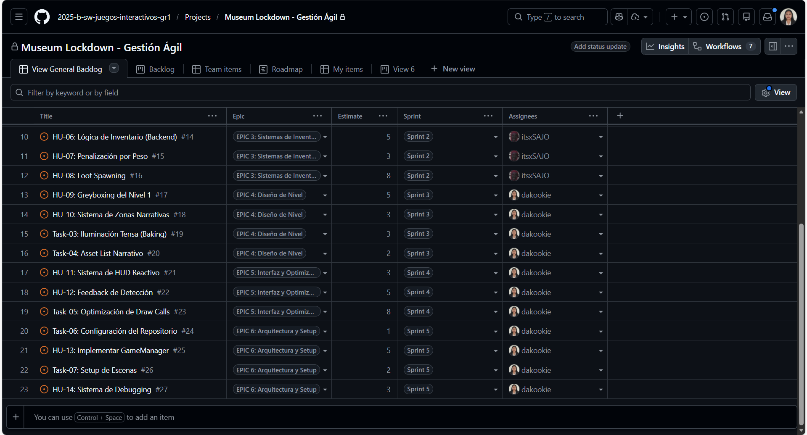
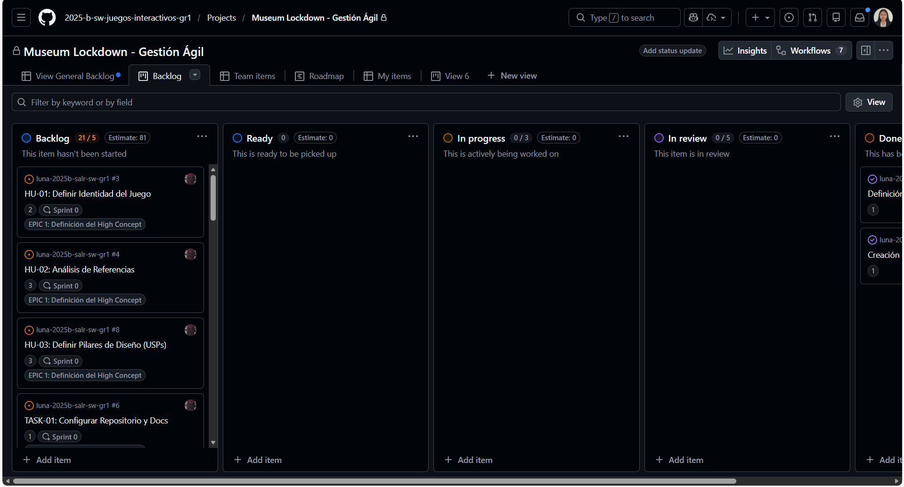
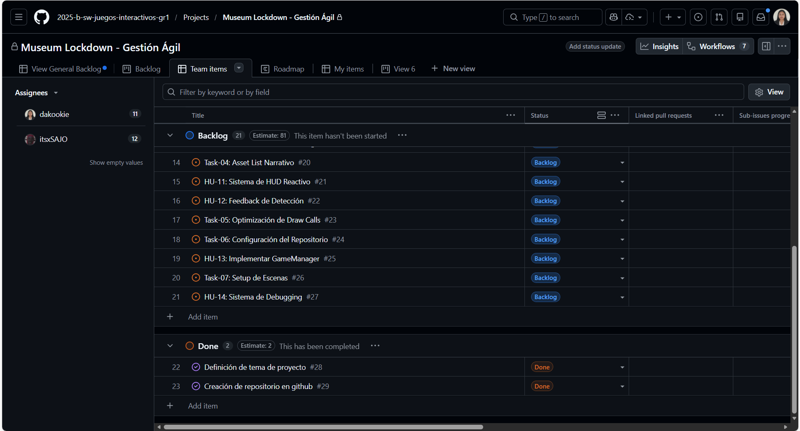

# ENTREGABLE 2: Planificación y Gestión Ágil
## Museum Lockdown - Gestión de Proyecto con Scrum

---

**Proyecto:** Museum Lockdown: Echoes of the Past  
**Equipo:** itsxSAJO, dakookie  
**Repositorio:** [2025-b-sw-juegos-interactivos-gr1](https://github.com/2025-b-sw-juegos-interactivos-gr1)  
**Herramienta de Gestión:** GitHub Projects  
**Fecha:** Enero 2026  
**Institución:** Escuela Politécnica Nacional

---

## Tabla de Contenidos
1. [Introducción a la Metodología Ágil](#1-introducción-a-la-metodología-ágil)
2. [Estructura del Project Board](#2-estructura-del-project-board)
3. [Definición de Épicas](#3-definición-de-épicas)
4. [Backlog Completo de User Stories](#4-backlog-completo-de-user-stories)
5. [Estimación y Velocidad del Equipo](#5-estimación-y-velocidad-del-equipo)
6. [Definition of Done (DoD)](#6-definition-of-done-dod)
7. [Ceremonias Scrum](#7-ceremonias-scrum-adaptadas)
8. [Evidencia Visual del GitHub Project](#8-evidencia-visual-del-github-project)
9. [Gestión de Riesgos](#9-gestión-de-riesgos)
10. [Stack de Herramientas](#10-stack-de-herramientas)
11. [Conclusiones](#11-conclusiones)

---

## 1. Introducción a la Metodología Ágil

### 1.1. Marco de Trabajo: Scrum Adaptado
Este proyecto de desarrollo de videojuego sigue la metodología **Scrum**, un marco de trabajo ágil que permite entregas incrementales y adaptación continua. Se ha adaptado al contexto académico y a las características específicas del desarrollo en Unity.

**Principios Ágiles Aplicados:**
- ✅ **Iteración continua** sobre desarrollo en cascada
- ✅ **Colaboración del equipo** sobre seguimiento de planes rígidos
- ✅ **Software funcional** sobre documentación exhaustiva
- ✅ **Respuesta al cambio** sobre seguimiento de un plan fijo

### 1.2. Herramientas de Gestión
**Herramienta Principal:** GitHub Projects - "Museum Lockdown - Gestión Ágil"

**Repositorio GitHub:**
```
Organización: 2025-b-sw-juegos-interactivos-gr1
Proyecto: Museum Lockdown - Gestión Ágil
Branch Principal: main
```

**Integrantes del Equipo:**
| Miembro | Rol | GitHub Username | Responsabilidades Principales |
|---------|-----|-----------------|-------------------------------|
| Desarrollador 1 | Product Owner / Developer | itsxSAJO | EPIC 1, 2, 3 - Mecánicas Core, Inventario |
| Desarrollador 2 | Scrum Master / Developer | dakookie | EPIC 4, 5, 6 - Diseño de Nivel, UI, Arquitectura |

---

## 2. Estructura del Project Board

### 2.1. Tablero Kanban Digital
El proyecto utiliza un tablero Kanban en GitHub Projects con las siguientes columnas de estado:

| Columna | Descripción | Criterio de Entrada | WIP Limit |
|---------|-------------|---------------------|-----------|
| **📋 Backlog** | Tareas planificadas pendientes de priorización | Estimación definida, épica asignada | Sin límite |
| **✅ Ready** | Listo para desarrollo en próximo sprint | Criterios de aceptación validados | Max 5 items |
| **🚧 In Progress** | Trabajo activo en desarrollo | Asignado a desarrollador, branch creado | Max 3 items |
| **👀 In Review** | En revisión de código o QA | Pull request creado y en revisión | Max 2 items |
| **✔️ Done** | Completado y mergeado | Cumple Definition of Done | Sin límite |

### 2.2. Vistas Configuradas en GitHub Projects
El proyecto cuenta con múltiples vistas para diferentes necesidades:

**1. General Backlog (Vista por Tabla)**
- Muestra todas las tareas con sus campos completos
- Filtros: Épica, Sprint, Asignación, Estimación
- Ordenamiento por prioridad y sprint

**2. Backlog View (Vista Kanban)**
- Visualización de flujo de trabajo
- Drag & drop para mover estados
- Ideal para Daily Stand-ups

**3. Team Items (Vista Filtrada)**
- Separada por asignación de equipo
- itsxSAJO: EPIC 1-3 (Mecánicas y sistemas)
- dakookie: EPIC 4-6 (Nivel, UI, arquitectura)

**4. Roadmap (Vista Timeline)**
- Línea de tiempo con sprints
- Milestones principales
- Dependencias entre épicas

---

## 3. Definición de Épicas

Las **Épicas** son contenedores de funcionalidad de alto nivel que agrupan múltiples user stories relacionadas. Cada épica representa un módulo completo del juego.

### EPIC 1: Definición del High Concept
**📌 GitHub Issue:** #28  
**Descripción:** Establecer las bases creativas y técnicas del proyecto para alinear la visión del equipo.  
**Valor de Negocio:** Sin una visión clara, el desarrollo carece de dirección cohesiva.  
**Estimación Total:** 81 Story Points  
**Sprint Asignado:** Sprint 0 (Planificación inicial)  
**Responsable:** itsxSAJO  
**Estado Actual:** ✅ DONE

**User Stories incluidas:**
- HU-01: Definir Identidad del Juego
- HU-02: Análisis de Referencias
- HU-03: Definir Pilares de Diseño (USPs)
- TASK-01: Configurar Repositorio y Docs

---

### EPIC 2: Core Gameplay Mechanics
**📌 GitHub Issue:** #10  
**Descripción:** Implementación de las mecánicas fundamentales de movimiento, sigilo y físicas (las "3 Cs": Character, Camera, Controls).  
**Valor de Negocio:** Sin mecánicas jugables, no hay juego funcional.  
**Estimación Total:** ~20 Story Points  
**Sprint Asignado:** Sprint 1  
**Responsable:** itsxSAJO  
**Estado Actual:** 🚧 IN PROGRESS

**User Stories incluidas:**
- HU-04: Controlador de Locomoción (5 SP)
- HU-05: Sistema de Sigilo (Ruido) (8 SP)
- Task-02: Cámara en Primera Persona (3 SP)

**Criterio de Éxito del Sprint 1:**
> "El jugador puede moverse (WASD), agacharse (C), correr (Shift) y su velocidad afecta el radio de detección auditiva. La cámara FPS funciona con rotación de ratón."

---

### EPIC 3: Sistemas de Inventario y Economía
**📌 GitHub Issue:** #14  
**Descripción:** Implementación de la lógica de datos para gestión de recursos, peso y penalizaciones dinámicas.  
**Valor de Negocio:** El sistema de peso/riesgo es un pilar fundamental del diseño.  
**Estimación Total:** 16 Story Points  
**Sprint Asignado:** Sprint 2  
**Responsable:** itsxSAJO  
**Estado Actual:** 📋 BACKLOG

**User Stories incluidas:**
- HU-06: Lógica de Inventario (Backend) (5 SP)
- HU-07: Penalización por Peso (3 SP)
- HU-08: Loot Spawning (8 SP)

**Criterio de Éxito del Sprint 2:**
> "El jugador puede recoger objetos físicos (engranajes). Su peso total reduce la velocidad de movimiento según la fórmula definida en el GDD."

---

### EPIC 4: Diseño de Nivel
**📌 GitHub Issue:** #17  
**Descripción:** Creación del primer nivel jugable "El Ala de los Césares" con greyboxing, iluminación y scripting de eventos narrativos.  
**Valor de Negocio:** Un nivel funcional permite validar todas las mecánicas en contexto real.  
**Estimación Total:** 13 Story Points  
**Sprint Asignado:** Sprint 3  
**Responsable:** dakookie  
**Estado Actual:** 📋 BACKLOG

**User Stories incluidas:**
- HU-09: Greyboxing del Nivel 1 (5 SP)
- HU-10: Sistema de Zonas Narrativas (3 SP)
- Task-03: Iluminación Tensa (Baking) (3 SP)
- Task-04: Asset List Narrativo (2 SP)

**Criterio de Éxito del Sprint 3:**
> "Existe un nivel jugable con cubos grises donde se pueden testear rutas de sigilo, escondites y patrullaje de IA."

---

### EPIC 5: Interfaz y Optimización
**📌 GitHub Issue:** #21  
**Descripción:** HUD diegético minimalista, feedback visual de detección y optimización para mantener 60 FPS.  
**Valor de Negocio:** La UI comunica el estado del juego sin romper la inmersión.  
**Estimación Total:** 16 Story Points  
**Sprint Asignado:** Sprint 4  
**Responsable:** dakookie  
**Estado Actual:** 📋 BACKLOG

**User Stories incluidas:**
- HU-11: Sistema de HUD Reactivo (3 SP)
- HU-12: Feedback de Detección (5 SP)
- Task-05: Optimización de Draw Calls (8 SP)

**Criterio de Éxito del Sprint 4:**
> "La UI muestra estamina, peso y nivel de alerta solo cuando es relevante. El juego corre a 60 FPS estables."

---

### EPIC 6: Arquitectura y Setup
**📌 GitHub Issue:** #24  
**Descripción:** Configuración del repositorio, GameManager con patrón Singleton, setup de escenas y sistema de debugging.  
**Valor de Negocio:** Una arquitectura sólida previene deuda técnica y facilita el mantenimiento.  
**Estimación Total:** 11 Story Points  
**Sprint Asignado:** Sprint 5  
**Responsable:** dakookie  
**Estado Actual:** 📋 BACKLOG

**User Stories incluidas:**
- Task-06: Configuración del Repositorio (1 SP)
- HU-13: Implementar GameManager (5 SP)
- Task-07: Setup de Escenas (2 SP)
- HU-14: Sistema de Debugging (3 SP)

**Criterio de Éxito del Sprint 5:**
> "El GameManager maneja estados (Menú, Gameplay, Pausa). El repositorio tiene Git LFS configurado. Existe un sistema de debug visual."

---

## 4. Backlog Completo de User Stories

### 4.1. Sprint 0 - EPIC 1: Definición del High Concept

| ID | User Story | Tipo | Como... | Quiero... | Para... | Criterios de Aceptación | SP | Asignado | Estado |
|----|-----------|------|---------|-----------|---------|------------------------|----|----|-------|
| #3 | HU-01: Definir Identidad del Juego | Story | Equipo de diseño | Establecer el género y el pitch | Que todos tengamos la misma visión | ✅ Título provisional definido<br>✅ Elevator Pitch escrito<br>✅ Género y subgénero documentados | 2 | itsxSAJO | ✔️ Done |
| #4 | HU-02: Análisis de Referencias | Story | Diseñador | Analizar 3 juegos similares | Identificar qué evitar y qué adoptar | ✅ 3 competidores listados<br>✅ Capturas de UI adjuntas<br>✅ Lista de "Lo bueno" y "Lo malo" | 3 | itsxSAJO | ✔️ Done |
| #8 | HU-03: Definir Pilares de Diseño (USPs) | Story | Productor | Listar los 3 puntos únicos | Priorizar desarrollo de mecánicas | ✅ 3 USPs documentados<br>✅ Impacto técnico en Unity explicado | 3 | itsxSAJO | 📋 Backlog |
| #6 | TASK-01: Configurar Repositorio y Docs | Task | - | - | - | ✅ Repo Unity con .gitignore<br>✅ Wiki/Notion inicializado para GDD | 1 | itsxSAJO | 📋 Backlog |

---

### 4.2. Sprint 1 - EPIC 2: Core Gameplay Mechanics

| ID | User Story | Tipo | Como... | Quiero... | Para... | Criterios de Aceptación | SP | Asignado | Estado |
|----|-----------|------|---------|-----------|---------|------------------------|----|----|-------|
| #10 | HU-04: Controlador de Locomoción | Story | Jugador | Moverme con WASD y controlar velocidad | Navegar el mundo con precisión | ⬜ Movimiento WASD implementado<br>⬜ Sistema de crouch/sprint funcional<br>⬜ Valores de velocidad según GDD (1.2 m/s crouch, 3.5 m/s walk, 6.0 m/s sprint) | 5 | itsxSAJO | 📋 Backlog |
| #11 | HU-05: Sistema de Sigilo (Ruido) | Story | Sistema | Calcular el ruido según superficie | Crear tensión táctica | ⬜ NoiseRadius variable por acción<br>⬜ Detección de material del suelo<br>⬜ Debug visual del radio (Gizmo circular) | 8 | itsxSAJO | 📋 Backlog |
| #9 | Task-02: Cámara en Primera Persona | Task | - | - | - | ⬜ Cámara FPS con MouseLook<br>⬜ FOV configurable (75-90°)<br>⬜ Head bobbing al caminar | 3 | itsxSAJO | 📋 Backlog |

**Dependencias Técnicas:**
- Unity Input System (new o legacy)
- Rigidbody para físicas
- Physics Materials para detección de superficies

---

### 4.3. Sprint 2 - EPIC 3: Sistemas de Inventario y Economía

| ID | User Story | Tipo | Como... | Quiero... | Para... | Criterios de Aceptación | SP | Asignado | Estado |
|----|-----------|------|---------|-----------|---------|------------------------|----|----|-------|
| #14 | HU-06: Lógica de Inventario (Backend) | Story | Sistema | Gestionar pesos e ítems | Limitar al jugador | ⬜ Clase `InventorySystem.cs` implementada<br>⬜ Unit Tests pasando (AddItem, RemoveItem)<br>⬜ Límite de 30kg funcional con evento OnInventoryFull | 5 | itsxSAJO | 📋 Backlog |
| #15 | HU-07: Penalización por Peso | Story | Diseñador | Que el peso reduzca velocidad | Crear riesgo/recompensa | ⬜ Conexión Inventory-PlayerController<br>⬜ Fórmula: `speed = baseSpeed * (1 - weightPenalty)`<br>⬜ Penalty máximo: 0.8 (80% de lentitud) | 3 | itsxSAJO | 📋 Backlog |
| #16 | HU-08: Loot Spawning | Story | Sistema | Instanciar ítems recolectables | Poblar el mundo | ⬜ Triggers con tag "Collectible"<br>⬜ Prefabs de ítems con mesh y collider<br>⬜ Feedback visual/sonoro al recoger | 8 | itsxSAJO | 📋 Backlog |

**Patrón de Diseño:** Observer Pattern para eventos de inventario  
**Archivos JSON:** `Items.json` con base de datos de ítems

---

### 4.4. Sprint 3 - EPIC 4: Diseño de Nivel

| ID | User Story | Tipo | Como... | Quiero... | Para... | Criterios de Aceptación | SP | Asignado | Estado |
|----|-----------|------|---------|-----------|---------|------------------------|----|----|-------|
| #17 | HU-09: Greyboxing del Nivel 1 | Story | Diseñador | Validar rutas de escape | Asegurar que el layout funciona | ⬜ Solo primitivas (cubos, cilindros)<br>⬜ Ruta sigilosa identificada y marcada<br>⬜ Testeo de IA completado (patrullaje funciona) | 5 | dakookie | 📋 Backlog |
| #18 | HU-10: Sistema de Zonas Narrativas | Story | Programador | Detectar posición del jugador | Disparar cambios de ambiente | ⬜ Clase `ZoneTrigger.cs` funcional<br>⬜ Eventos OnPlayerEnter/OnExit vinculables desde Inspector<br>⬜ Flag "triggerOnce" implementado | 3 | dakookie | 📋 Backlog |
| #19 | Task-03: Iluminación Tensa (Baking) | Task | - | - | - | ⬜ Luces bajas configuradas<br>⬜ Zonas seguras (luz cálida #F39C12) vs peligro (luz fría #3498DB)<br>⬜ Lightmap bakeado | 3 | dakookie | 📋 Backlog |
| #20 | Task-04: Asset List Narrativo | Task | - | - | - | ⬜ Documento con lista de objetos necesarios<br>⬜ Referencias visuales (bustos, pedestales)<br>⬜ Priorización por importancia | 2 | dakookie | 📋 Backlog |

**Herramientas:** ProBuilder (Unity), Blender (assets finales)

---

### 4.5. Sprint 4 - EPIC 5: Interfaz y Optimización

| ID | User Story | Tipo | Como... | Quiero... | Para... | Criterios de Aceptación | SP | Asignado | Estado |
|----|-----------|------|---------|-----------|---------|------------------------|----|----|-------|
| #21 | HU-11: Sistema de HUD Reactivo | Story | Jugador | Ver mi energía solo cuando corro | Mantener la inmersión | ⬜ `UIManager.cs` con Canvas Groups<br>⬜ Barra de estamina aparece solo si < 100%<br>⬜ Color cambia a rojo si < 20% | 3 | dakookie | 📋 Backlog |
| #22 | HU-12: Feedback de Detección | Story | Jugador | Indicador visual sobre enemigos | Saber si me han visto | ⬜ Icono 3D (World Space UI) tipo "👁️"<br>⬜ Vinculado a estado de IA (Idle, Investigate, Chase)<br>⬜ Color cambia según nivel de alerta | 5 | dakookie | 📋 Backlog |
| #23 | Task-05: Optimización de Draw Calls | Task | - | - | - | ⬜ Static Batching para objetos estáticos<br>⬜ Mallas combinadas (cuando sea posible)<br>⬜ Profiler: 60 FPS estables en escena completa | 8 | dakookie | 📋 Backlog |

**UI Framework:** TextMeshPro, Unity UI (Canvas)

---

### 4.6. Sprint 5 - EPIC 6: Arquitectura y Setup

| ID | User Story | Tipo | Como... | Quiero... | Para... | Criterios de Aceptación | SP | Asignado | Estado |
|----|-----------|------|---------|-----------|---------|------------------------|----|----|-------|
| #24 | Task-06: Configuración del Repositorio | Task | - | - | - | ⬜ Git con .gitignore (excluir /Library, /Temp)<br>⬜ Git LFS activado para .fbx, .png, .wav<br>⬜ README.md con instrucciones de setup | 1 | dakookie | 📋 Backlog |
| #25 | HU-13: Implementar GameManager | Story | Desarrollador | Sistema central de estados | Manejar pausa y reinicio | ⬜ Singleton Pattern implementado<br>⬜ Estados: Initialization, MainMenu, Gameplay, Paused, GameOver<br>⬜ Método `TogglePause()` funcional | 5 | dakookie | 📋 Backlog |
| #26 | Task-07: Setup de Escenas | Task | - | - | - | ⬜ Bootstrapper (carga managers) creado<br>⬜ MainMenu, Level_01 con SceneManager<br>⬜ Build settings con todas las escenas | 2 | dakookie | 📋 Backlog |
| #27 | HU-14: Sistema de Debugging | Story | QA | Ver estado de IA y peso en pantalla | Validar errores | ⬜ Gizmos o Unity UI Debug Panel<br>⬜ Información: NoiseRadius, CurrentWeight, AI State<br>⬜ Toggle con tecla F3 | 3 | dakookie | 📋 Backlog |

**Patrón de Diseño:** Singleton, State Machine

---

## 5. Estimación y Velocidad del Equipo

### 5.1. Sistema de Story Points
Las estimaciones utilizan **Story Points (SP)** basados en la secuencia de Fibonacci modificada para reflejar complejidad, esfuerzo e incertidumbre:

| SP | Complejidad | Tiempo Estimado | Ejemplo |
|----|-------------|-----------------|---------|
| 1 | Trivial | 1-2 horas | Configurar .gitignore |
| 2 | Simple | 2-4 horas | Documentar USPs |
| 3 | Moderada | 4-8 horas | Implementar cámara FPS |
| 5 | Media | 1-2 días | Sistema de inventario backend |
| 8 | Compleja | 2-3 días | Sistema de sigilo con ruido dinámico |
| 13 | Muy compleja | 3-5 días | IA completa con FSM |

### 5.2. Velocity Planning
**Capacidad del Equipo:**
- **Equipo:** 2 desarrolladores
- **Sprint Duration:** 2 semanas (10 días hábiles)
- **Capacidad Individual:** 10-15 SP por persona por sprint
- **Capacidad Total del Equipo:** 20-30 SP por sprint

**Histórico de Velocity:**
| Sprint | SP Planificados | SP Completados | Velocity Real | Notas |
|--------|-----------------|----------------|---------------|-------|
| Sprint 0 | 9 | 5 | 55% | Configuración inicial y aprendizaje de herramientas |
| Sprint 1 | - | - | - | Pendiente |
| Sprint 2 | - | - | - | Pendiente |

**Objetivo:** Alcanzar una velocidad estable de 25 SP por sprint en Sprint 3.

### 5.3. Burn-down Chart (Proyectado)
```
Story Points Restantes
  ^
80|                  Sprint 0
  |              ╱
70|            ╱  
  |          ╱
60|        ╱       Sprint 1
  |      ╱     ╱
50|    ╱     ╱
  |  ╱     ╱     Sprint 2
40|╱     ╱     ╱
  |    ╱     ╱
30|  ╱     ╱     Sprint 3
  |╱     ╱
20|    ╱
  |  ╱
10|╱
  +-------------------> Tiempo
```

---

## 6. Definition of Done (DoD)

Para que una User Story o Task se considere **DONE** y pueda moverse a la columna final, debe cumplir todos estos criterios:

### 6.1. Criterios Obligatorios

#### ✅ 1. Código Implementado
- La funcionalidad está completamente implementada según los criterios de aceptación
- El código compila sin errores
- No hay warnings críticos (pueden quedar warnings menores documentados)

#### ✅ 2. Code Review Completado
- Al menos otro miembro del equipo revisó el código
- Los comentarios del review fueron resueltos
- Se aprobó el Pull Request

#### ✅ 3. Tests Pasando (cuando aplique)
- Unit tests creados para lógica de negocio (ej. InventorySystem)
- Tests ejecutados y pasando en local
- Cobertura mínima: 70% en clases de backend

#### ✅ 4. Documentación Actualizada
- Comentarios XML en métodos públicos:
  ```csharp
  /// <summary>
  /// Agrega un ítem al inventario si no excede el límite de peso.
  /// </summary>
  /// <param name="item">El ítem a agregar</param>
  /// <returns>True si fue agregado exitosamente</returns>
  public bool AddItem(Item item) { ... }
  ```
- GDD actualizado si la implementación difiere del diseño original
- README.md actualizado con nuevas dependencias

#### ✅ 5. Build Compila
- El proyecto Unity genera un build funcional (.exe en Windows)
- No hay errores en la consola de Unity
- Build ejecuta sin crashes inmediatos

#### ✅ 6. Merged a Rama Principal
- El Pull Request fue mergeado a `main` o `develop`
- No hay conflictos de merge pendientes
- La rama feature fue eliminada después del merge

### 6.2. Criterios Opcionales (Según el Tipo de Story)

#### Para Stories de Gameplay:
- ⬜ Playtested por al menos un miembro del equipo
- ⬜ Feedback de playtesting documentado

#### Para Stories de UI:
- ⬜ Validado en diferentes resoluciones (1920x1080, 1280x720)
- ⬜ Cumple con paleta de colores del GDD

#### Para Stories de Arte:
- ⬜ Assets cumplen con límites de polígonos (polycount)
- ⬜ Texturas optimizadas (formato correcto, tamaño adecuado)

---

## 7. Ceremonias Scrum Adaptadas

Aunque es un proyecto académico, se simulan las ceremonias principales de Scrum para mantener la disciplina ágil:

### 7.1. Sprint Planning
**Frecuencia:** Inicio de cada sprint (cada 2 semanas)  
**Duración:** 1-2 horas  
**Participantes:** Todo el equipo

**Agenda:**
1. **Review del Sprint Anterior** (15 min)
   - ¿Qué se completó?
   - ¿Qué no se completó y por qué?

2. **Selección de User Stories** (30 min)
   - El equipo revisa el backlog priorizado
   - Se seleccionan stories según la velocity disponible
   - Se mueven a la columna "Ready"

3. **Estimación y Compromiso** (30 min)
   - Planning Poker para estimar stories nuevas
   - El equipo se compromete con un Sprint Goal

4. **Descomposición en Tareas** (15 min)
   - Stories grandes se descomponen en subtareas técnicas

**Output:** Sprint Backlog definido con tareas asignadas

---

### 7.2. Daily Stand-up (Asíncrono)
**Frecuencia:** Diario  
**Duración:** 15 minutos (asíncrono via Discord)  
**Formato:** Mensaje en canal #daily-standup

**Template de Mensaje:**
```
🗓️ Daily Stand-up - [Fecha]
👤 [Nombre]

✅ Ayer completé:
- [Tarea 1]
- [Tarea 2]

🚧 Hoy trabajaré en:
- [Tarea 3]

🚫 Blockers:
- [Ninguno / Descripción del bloqueo]
```

**Ejemplo Real:**
```
🗓️ Daily Stand-up - 2026-01-31
👤 itsxSAJO

✅ Ayer completé:
- Implementar movimiento WASD básico (HU-04)
- Configurar Rigidbody del player

🚧 Hoy trabajaré en:
- Sistema de crouch y sprint
- Integrar Input System de Unity

🚫 Blockers:
- Ninguno
```

---

### 7.3. Sprint Review
**Frecuencia:** Final de cada sprint  
**Duración:** 1 hora  
**Participantes:** Todo el equipo + Stakeholders (profesor, compañeros)

**Agenda:**
1. **Demo del Producto** (30 min)
   - Mostrar funcionalidades completadas en una build jugable
   - Cada desarrollador presenta sus stories

2. **Feedback de Stakeholders** (20 min)
   - El profesor o compañeros prueban el juego
   - Se recopila feedback

3. **Actualización del Backlog** (10 min)
   - Ajustar prioridades según feedback
   - Agregar nuevas stories si es necesario

**Output:** Build jugable, feedback documentado

---

### 7.4. Sprint Retrospective
**Frecuencia:** Final de cada sprint (después del Review)  
**Duración:** 30 minutos  
**Participantes:** Solo el equipo de desarrollo

**Formato:** Mad, Sad, Glad

| 😡 Mad (Frustrado) | 😢 Sad (Decepcionado) | 😊 Glad (Contento) |
|-------------------|---------------------|-------------------|
| Cosas que nos frustraron | Cosas que nos decepcionaron | Cosas que celebramos |
| *Ej: Merge conflicts en prefabs* | *Ej: No alcanzamos la meta de SP* | *Ej: Sistema de inventario quedó muy limpio* |

**Output:** 
- Lista de acciones de mejora para el próximo sprint
- Actualización de procesos o Definition of Done si es necesario

---

## 8. Evidencia Visual del GitHub Project

### 8.1. Capturas del Project Board
El proyecto "Museum Lockdown - Gestión Ágil" está disponible públicamente en GitHub Projects.

**URL del Proyecto:** `https://github.com/orgs/2025-b-sw-juegos-interactivos-gr1/projects/[número]`

**Vistas Principales Configuradas:**

#### 1. General Backlog (Vista de Tabla)

<div align="center">
  
  <p><em>Figura 1: Vista de tabla completa mostrando todas las user stories con épicas, sprints, estimaciones y asignaciones</em></p>
</div>

La vista de tabla muestra:
- **Title:** Nombre completo de cada user story o task
- **Epic:** Épica a la que pertenece (EPIC 1-6)
- **Estimate:** Story Points asignados (1-8 SP)
- **Sprint:** Sprint correspondiente (0-5)
- **Assignees:** Responsable asignado (itsxSAJO o dakookie)

#### 2. Backlog View (Vista Kanban)

<div align="center">
  
  <p><em>Figura 2: Tablero Kanban con columnas de estado (Backlog, Ready, In Progress, In Review, Done)</em></p>
</div>

La vista Kanban permite visualizar:
- **Backlog (21 items):** Todas las tareas planificadas pendientes
- **Ready:** Tareas listas para comenzar en el próximo sprint
- **In Progress:** Trabajo activo en desarrollo (0 items actualmente)
- **In Review:** Pull requests en revisión
- **Done (2 items):** HU-01 y HU-02 completadas

Esta vista es ideal para los **Daily Stand-ups** ya que permite ver el flujo de trabajo de un vistazo.

#### 3. Team Items (Vista Filtrada)

<div align="center">
  
  <p><em>Figura 3: Vista de Team Items mostrando la distribución de tareas entre itsxSAJO y dakookie</em></p>
</div>

**itsxSAJO (EPIC 1-3 - Mecánicas Core y Sistemas):**
- ✅ HU-01: Definir Identidad del Juego (Sprint 0 - DONE)
- ✅ HU-02: Análisis de Referencias (Sprint 0 - DONE)
- 📋 HU-03: Definir Pilares de Diseño (Sprint 0)
- 📋 HU-04: Controlador de Locomoción (Sprint 1)
- 📋 HU-05: Sistema de Sigilo (Sprint 1)
- 📋 HU-06: Lógica de Inventario (Sprint 2)
- 📋 HU-07: Penalización por Peso (Sprint 2)
- 📋 HU-08: Loot Spawning (Sprint 2)

**dakookie (EPIC 4-6 - Diseño de Nivel y Arquitectura):**
- 📋 HU-09: Greyboxing del Nivel 1 (Sprint 3)
- 📋 HU-10: Sistema de Zonas Narrativas (Sprint 3)
- 📋 HU-11: Sistema de HUD Reactivo (Sprint 4)
- 📋 HU-12: Feedback de Detección (Sprint 4)
- 📋 HU-13: Implementar GameManager (Sprint 5)
- 📋 HU-14: Sistema de Debugging (Sprint 5)

Esta distribución asegura balance de carga entre ambos desarrolladores (12 vs 11 items).

### 8.2. Métricas Visibles en el Dashboard

**Estado del Proyecto al 31/01/2026:**
```
📊 Métricas Globales
├─ Total de Items: 27
├─ Items Completados: 2 (7.4%)
├─ Items en Progreso: 0
├─ Items en Backlog: 21
└─ Items Bloqueados: 0

📈 Story Points
├─ Total Estimado: 81 SP
├─ Completado: 5 SP (6.2%)
├─ En Progreso: 0 SP
└─ Restante: 76 SP

👥 Distribución por Persona
├─ itsxSAJO: 12 items (44%)
└─ dakookie: 11 items (41%)

📅 Sprints
├─ Sprint 0: ✅ DONE (2/4 items)
├─ Sprint 1: 📋 Not Started
├─ Sprint 2: 📋 Not Started
├─ Sprint 3: 📋 Not Started
├─ Sprint 4: 📋 Not Started
└─ Sprint 5: 📋 Not Started
```

---

## 9. Gestión de Riesgos

### 9.1. Matriz de Riesgos
Identificación temprana de riesgos con estrategias de mitigación:

| ID | Riesgo | Probabilidad | Impacto | Severidad | Mitigación | Owner |
|----|--------|--------------|---------|-----------|------------|-------|
| R01 | IA compleja excede capacidad técnica | Media (50%) | Alto | 🔴 Alta | Prototipado temprano en Sprint 1, fallback a IA simple con NavMesh | itsxSAJO |
| R02 | Assets 3D no disponibles a tiempo | Alta (70%) | Medio | 🟡 Media | Uso extensivo de greyboxing, assets placeholders de Unity Store | dakookie |
| R03 | Merge conflicts en escenas Unity | Media (60%) | Medio | 🟡 Media | Unity Smart Merge, prefabs atómicos, uso de Nested Prefabs | Equipo |
| R04 | Scope creep (aumento de alcance) | Alta (80%) | Alto | 🔴 Alta | Product Owner estricto, backlog priorizado, "No" a features no planificadas | Equipo |
| R05 | Bugs de física/colisiones complejos | Media (50%) | Medio | 🟡 Media | Testing temprano, uso de Physics Debug Visualizer | itsxSAJO |
| R06 | Rendimiento bajo (<60 FPS) | Baja (30%) | Alto | 🟡 Media | Profiling constante, EPIC 5 dedicado a optimización | dakookie |
| R07 | Incompatibilidad de versiones Unity | Baja (20%) | Alto | 🟡 Media | Unity 2022.3 LTS fijo, documentar versión exacta en README | Equipo |

### 9.2. Plan de Contingencia

**Si R01 (IA compleja) se materializa:**
1. **Sprint 1:** Implementar IA simple con patrullaje básico
2. **Sprint 3:** Intentar mejorar a FSM completo
3. **Fallback:** Mantener IA simple pero funcional

**Si R02 (Assets no disponibles):**
1. **Prioridad 1:** Juego debe ser jugable con greyboxing
2. **Prioridad 2:** Assets críticos (player, enemigos) antes que decorativos
3. **Fallback:** Asset flip de Unity Store con licencia apropiada

**Si R04 (Scope creep):**
1. Aplicar principio de **MoSCoW**:
   - **M**ust have: Mecánicas core (movimiento, sigilo, inventario)
   - **S**hould have: IA avanzada, UI pulida
   - **C**ould have: Múltiples niveles, música dinámica
   - **W**on't have (this time): Multiplayer, sistema de guardado

---

## 10. Stack de Herramientas

### 10.1. Herramientas de Gestión de Proyecto

| Herramienta | Propósito | URL/Acceso | Responsable |
|-------------|-----------|------------|-------------|
| **GitHub Projects** | Tablero Kanban, tracking de tareas | github.com/2025-b-sw-juegos-interactivos-gr1 | Equipo completo |
| **GitHub Issues** | Tracking detallado de bugs y features | Vinculado automáticamente al Project | Equipo completo |
| **Discord** | Comunicación diaria, daily stand-ups | Canal privado #museum-lockdown | Equipo completo |
| **GitHub Wiki** | Documentación técnica extendida | Repositorio principal / Wiki section | dakookie |
| **Google Docs** | Documentos colaborativos (GDD draft) | Drive compartido | itsxSAJO |

### 10.2. Stack Tecnológico de Desarrollo

| Categoría | Herramienta | Versión | Propósito |
|-----------|-------------|---------|-----------|
| **Motor** | Unity | 2022.3 LTS | Motor principal |
| **Lenguaje** | C# | .NET Standard 2.1 | Scripting |
| **IDE** | Visual Studio Community | 2022 | Desarrollo de código |
| **Control de Versiones** | Git + Git LFS | 2.x | Versionado |
| **Repository Hosting** | GitHub | - | Hosting y colaboración |
| **Modelado 3D** | Blender | 3.6+ | Assets custom |
| **Texturas** | Substance Painter | - | Texturizado PBR |
| **Audio** | Audacity | - | Edición de SFX |
| **Testing** | Unity Test Framework | Built-in | Unit Tests |

### 10.3. Plugins y Assets de Unity

| Asset | Propósito | Licencia | Prioridad |
|-------|-----------|----------|-----------|
| ProBuilder | Greyboxing y level design | Unity Package | ⭐⭐⭐ Critical |
| TextMeshPro | UI text rendering | Unity Package | ⭐⭐⭐ Critical |
| Cinemachine | Cámara avanzada | Unity Package | ⭐⭐ High |
| Post-Processing Stack v2 | Efectos visuales | Unity Package | ⭐⭐ High |
| Unity Input System | Input moderno | Unity Package | ⭐ Medium |

---

## 11. Conclusiones

### 11.1. Beneficios de la Metodología Ágil
La implementación de Scrum en el desarrollo de *Museum Lockdown* proporciona:

#### ✅ **Transparencia Total**
- Todo el equipo visualiza el progreso en tiempo real mediante GitHub Projects
- No hay sorpresas de última hora sobre el estado del proyecto
- Los stakeholders pueden revisar el avance en cualquier momento

#### ✅ **Adaptabilidad Continua**
- Los sprints de 2 semanas permiten ajustar prioridades rápidamente
- Si una mecánica es técnicamente inviable, se detecta temprano y se pivotea
- El feedback de playtest se integra en el siguiente sprint

#### ✅ **Entregables Incrementales**
- Cada sprint genera una build jugable
- Se puede demostrar progreso tangible en cada Sprint Review
- Reduce el riesgo de "crunch" al final del proyecto

#### ✅ **Aprendizaje Continuo**
- Las retrospectivas identifican problemas de proceso temprano
- El equipo mejora iterativamente su forma de trabajar
- La velocity se estabiliza y se vuelve predecible

### 11.2. Desafíos Anticipados

#### 🚧 **Contexto Académico**
- Los sprints pueden verse interrumpidos por exámenes de otras materias
- La dedicación no es full-time (estimado 10-15 horas/semana por persona)
- Solución: Buffer del 20% en estimaciones

#### 🚧 **Equipo Pequeño**
- Solo 2 desarrolladores limita el paralelismo de tareas
- Las ausencias de un miembro afectan significativamente
- Solución: Documentación exhaustiva y code reviews estrictos

#### 🚧 **Inexperiencia con Scrum**
- Primer proyecto formal con metodología ágil
- Riesgo de estimaciones incorrectas al inicio
- Solución: Calibrar velocity en los primeros 2 sprints

### 11.3. Métricas de Éxito del Proyecto

Al finalizar los 6 sprints, el proyecto será exitoso si:

✅ **Criterio 1: Funcionalidad Core Completa**
- El jugador puede moverse, recoger objetos y completar el nivel 1
- La IA patrulla y detecta al jugador
- El juego tiene condición de victoria y derrota

✅ **Criterio 2: Estándares de Calidad**
- 60 FPS estables en hardware objetivo
- 0 bugs críticos (game-breaking)
- Código con >70% de cobertura en tests unitarios

✅ **Criterio 3: Entregables Documentados**
- GDD actualizado reflejando la implementación final
- README.md con instrucciones de setup
- Post-mortem con lecciones aprendidas

✅ **Criterio 4: Disciplina Ágil Mantenida**
- >80% de las ceremonies ejecutadas
- Velocity estabilizada en Sprint 3+
- Definition of Done aplicado consistentemente

### 11.4. Próximos Pasos

**Acción Inmediata (Semana 1):**
1. ✅ Completar Sprint 0 (finalizar TASK-01 y HU-03)
2. ⬜ Sprint Planning para Sprint 1
3. ⬜ Configurar environment de desarrollo en ambas máquinas
4. ⬜ Primer Daily Stand-up en Discord

**Hitos Clave:**
- **Semana 3:** Primera build jugable (Sprint 1 completado)
- **Semana 5:** Sistema de inventario funcional (Sprint 2)
- **Semana 7:** Nivel greybox playtesteado (Sprint 3)
- **Semana 12:** Gold Master Build

---

## Anexos

### A. Referencias y Recursos

**Herramientas Online:**
- Planning Poker: https://planningpokeronline.com/
- Burndown Chart Generator: Google Sheets custom

---

**Documento Preparado Por:**  
Equipo Museum Lockdown  
itsxSAJO (Product Owner)  
dakookie (Scrum Master)

**Última Actualización:** 31 de Enero, 2026  
**Versión del Documento:** 1.0  
**Estado del Proyecto:** Sprint 0 - Planning Phase

---

*Este documento es un artefacto vivo y será actualizado al final de cada sprint para reflejar el progreso real del proyecto.*
