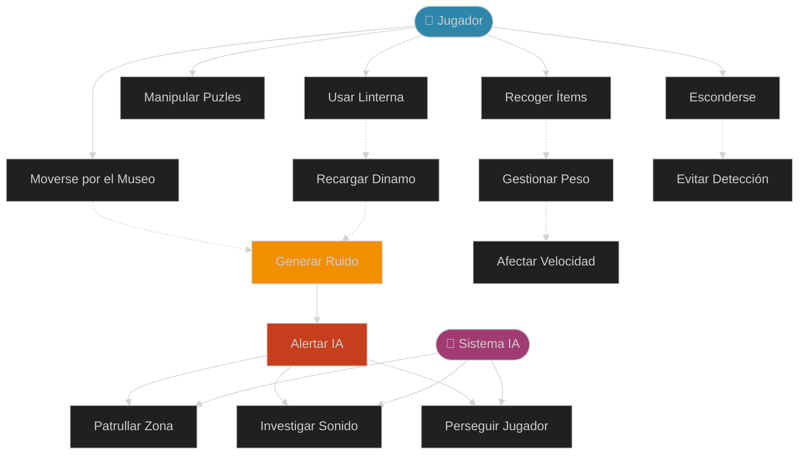
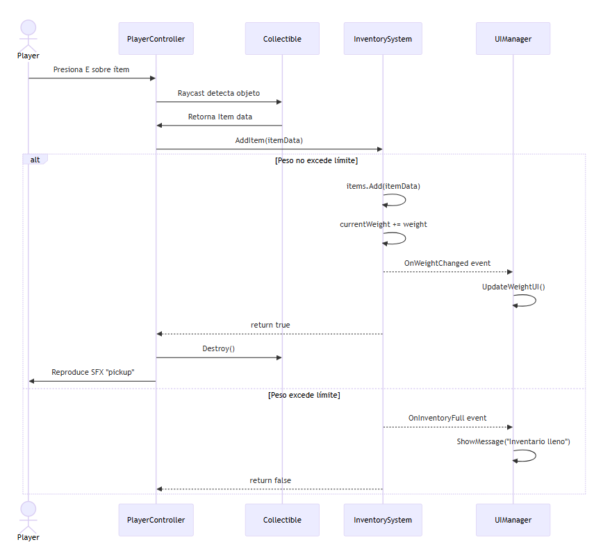
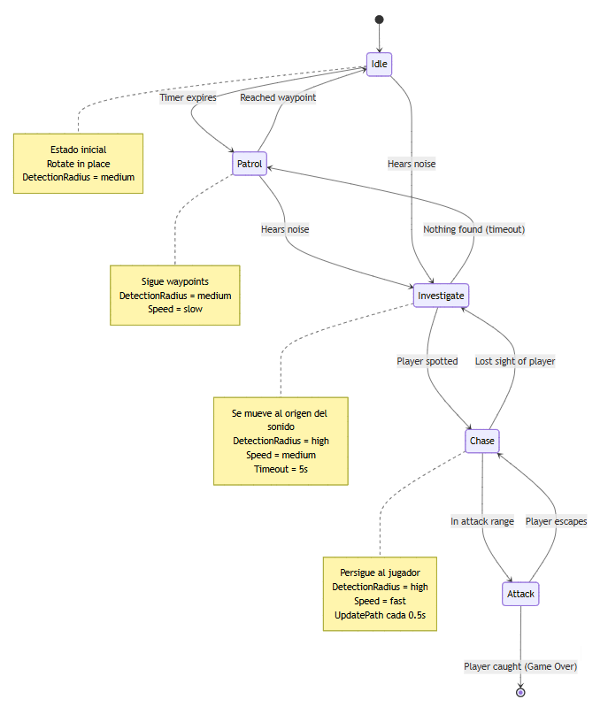
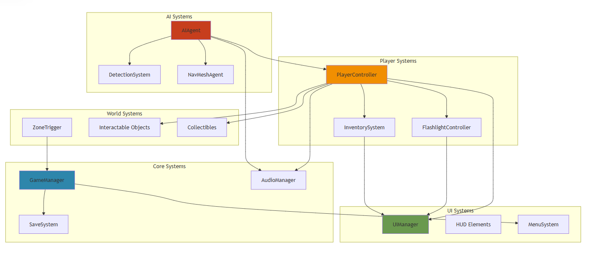
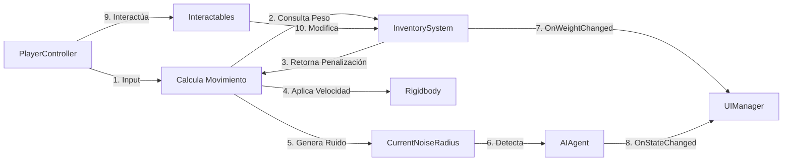

# ENTREGABLE 3: Arquitectura Técnica (Ingeniería de Software)
## Museum Lockdown - Diseño de Solución Técnica

---

**Proyecto:** Museum Lockdown: Echoes of the Past  
**Equipo:** itsxSAJO, dakookie  
**Repositorio:** [2025-b-sw-juegos-interactivos-gr1](https://github.com/2025-b-sw-juegos-interactivos-gr1)  
**Fecha:** Enero 2026  
**Institución:** Escuela Politécnica Nacional

---

## Tabla de Contenidos
1. [Introducción a la Arquitectura](#1-introducción-a-la-arquitectura)
2. [Filosofía Arquitectónica](#2-filosofía-arquitectónica)
3. [Diagramas UML](#3-diagramas-uml)
4. [Patrones de Diseño](#4-patrones-de-diseño)
5. [Stack Tecnológico](#5-stack-tecnológico)
6. [Estructura del Proyecto](#6-estructura-del-proyecto)
7. [Diseño de Sistemas Core](#7-diseño-de-sistemas-core)
8. [Integración y Comunicación entre Módulos](#8-integración-y-comunicación-entre-módulos)
9. [Consideraciones de Rendimiento](#9-consideraciones-de-rendimiento)
10. [Conclusiones y Decisiones Técnicas](#10-conclusiones-y-decisiones-técnicas)

---

## 1. Introducción a la Arquitectura

### 1.1. Visión General
La arquitectura de *Museum Lockdown* está diseñada para ser **escalable, mantenible y testeable**, siguiendo principios de ingeniería de software modernos adaptados al desarrollo en Unity. El diseño prioriza la **separación de responsabilidades** y la **composición sobre herencia** para evitar la complejidad innecesaria.

### 1.2. Objetivos Arquitectónicos

| Objetivo | Descripción | Métrica de Éxito |
|----------|-------------|------------------|
| **Modularidad** | Sistemas independientes con interfaces claras | Acoplamiento bajo (< 3 dependencias por clase) |
| **Testabilidad** | Lógica de negocio separada de MonoBehaviour | > 70% cobertura en unit tests |
| **Escalabilidad** | Fácil agregar nuevas mecánicas sin refactorizar | Tiempo de integración < 1 día |
| **Mantenibilidad** | Código legible con convenciones consistentes | Code review < 30 min por PR |
| **Performance** | 60 FPS estables en hardware objetivo | Frame time < 16.67ms |

### 1.3. Restricciones Técnicas

**Hardware Objetivo:**
- **CPU:** Intel Core i5 (4 núcleos) o equivalente
- **GPU:** NVIDIA GTX 1050 Ti o equivalente (2GB VRAM)
- **RAM:** 8 GB
- **Almacenamiento:** 2 GB disponibles

**Software:**
- **Motor:** Unity 2022.3 LTS
- **Plataforma:** Windows 10/11 (64-bit)
- **Resolución:** 1920x1080 (soporte para 1280x720)

---

## 2. Filosofía Arquitectónica

### 2.1. Principios SOLID Aplicados

#### **S - Single Responsibility Principle (Principio de Responsabilidad Única)**
Cada clase tiene una única razón para cambiar.

**Ejemplo:**
- `InventorySystem.cs` → Solo gestiona ítems y peso
- `PlayerController.cs` → Solo gestiona movimiento
- `UIManager.cs` → Solo actualiza interfaz visual

**Anti-patrón evitado:**
```csharp
// ❌ MAL: Una clase que hace demasiado
public class Player : MonoBehaviour {
    void Move() { ... }
    void UpdateUI() { ... }
    void ManageInventory() { ... }
    void PlaySounds() { ... }
}
```

**Patrón correcto:**
```csharp
// ✅ BIEN: Responsabilidades separadas
public class PlayerController : MonoBehaviour {
    private InventorySystem inventory;
    private PlayerAudioController audio;
    
    void Move() { ... } // Solo movimiento
}
```

---

#### **O - Open/Closed Principle (Abierto/Cerrado)**
Las clases están abiertas para extensión pero cerradas para modificación.

**Implementación:**
Uso de **ScriptableObjects** para datos configurables, permitiendo agregar nuevos ítems sin tocar código.

```csharp
// ✅ Extensible mediante datos
[CreateAssetMenu(fileName = "NewItem", menuName = "Game/Item")]
public class ItemData : ScriptableObject {
    public string id;
    public float weight;
    public ItemType type;
}

// Agregar nuevos ítems no requiere cambiar InventorySystem
```

---

#### **L - Liskov Substitution Principle (Sustitución de Liskov)**
Las clases derivadas deben ser sustituibles por sus clases base sin romper funcionalidad.

**Ejemplo con Interfaces:**
```csharp
public interface IInteractable {
    void Interact(GameObject actor);
    bool CanInteract { get; }
}

// Cualquier objeto que implemente IInteractable puede ser usado intercambiablemente
public class Lever : MonoBehaviour, IInteractable { ... }
public class Door : MonoBehaviour, IInteractable { ... }
public class Collectible : MonoBehaviour, IInteractable { ... }
```

---

#### **I - Interface Segregation Principle (Segregación de Interfaces)**
Los clientes no deben depender de interfaces que no usan.

**Ejemplo:**
```csharp
// ❌ MAL: Interfaz demasiado grande
public interface IGameEntity {
    void Move();
    void Attack();
    void Interact();
    void PlayAnimation();
}

// ✅ BIEN: Interfaces específicas
public interface IMovable {
    void Move(Vector3 direction, float speed);
}

public interface IInteractable {
    void Interact(GameObject actor);
}

public interface IAnimated {
    void PlayAnimation(string animName);
}
```

---

#### **D - Dependency Inversion Principle (Inversión de Dependencias)**
Depender de abstracciones, no de concreciones.

**Implementación:**
```csharp
// ✅ PlayerController depende de una abstracción (interfaz)
public class PlayerController : MonoBehaviour {
    [SerializeField] private IInputProvider inputProvider;
    
    void Update() {
        Vector2 input = inputProvider.GetMovementInput();
        Move(input);
    }
}

// Fácilmente testeable con un mock
public class MockInputProvider : IInputProvider {
    public Vector2 GetMovementInput() => Vector2.zero;
}
```

---

### 2.2. Composición sobre Herencia

En lugar de cadenas de herencia profundas, usamos **componentes modulares**.

**Anti-patrón evitado:**
```csharp
// ❌ Herencia profunda difícil de mantener
MonoBehaviour → Entity → LivingEntity → Enemy → Statue → RomanStatue
```

**Arquitectura basada en Componentes:**
```csharp
// ✅ Composición modular
public class AIAgent : MonoBehaviour {
    [SerializeField] private DetectionSystem detection;
    [SerializeField] private MovementSystem movement;
    [SerializeField] private AIStateMachine stateMachine;
}

// Cada componente es reutilizable e independiente
```

---

### 2.3. Data-Driven Design

Los datos del juego están separados del código mediante **ScriptableObjects** y **JSON**.

**Beneficios:**
- ✅ Diseñadores pueden balancear valores sin programar
- ✅ Fácil crear variantes (ItemData_Heavy, ItemData_Light)
- ✅ Cambios no requieren recompilación

**Ejemplo:**
```json
// items.json
[
  {
    "id": "heavy_gear",
    "name": "Engranaje de Bronce",
    "weight": 12.5,
    "type": "puzzle_part",
    "energyValue": 0
  },
  {
    "id": "dynamo_oil",
    "name": "Aceite Sintético",
    "weight": 0.5,
    "type": "consumable",
    "energyValue": 25.0
  }
]
```

---

## 3. Diagramas UML

### 3.1. Diagrama de Casos de Uso



**Descripción de Casos de Uso Principales:**

| ID | Caso de Uso | Actor | Descripción | Precondición |
|----|-------------|-------|-------------|--------------|
| UC1 | Moverse por el Museo | Jugador | El jugador navega usando WASD, crouch y sprint | Nivel cargado |
| UC2 | Recoger Ítems | Jugador | El jugador interactúa con objetos recolectables | Dentro del radio de interacción |
| UC3 | Manipular Puzles | Jugador | El jugador rota engranajes y palancas físicamente | Objeto interactuable disponible |
| UC6 | Generar Ruido | Sistema | Cada acción del jugador genera un radio de detección | Jugador en movimiento |
| UC10 | Alertar IA | Sistema | Las exhibiciones detectan al jugador por sonido o vista | NoiseRadius interseca con AI |
| UC13 | Perseguir Jugador | IA | Las estatuas persiguen al jugador en estado de alerta | Detección confirmada |

---

### 3.2. Diagrama de Clases (Core Systems)

<div align="center">
  
</div>

**Descripción de Clases Principales:**

#### **GameManager (Singleton)**
- **Responsabilidad:** Controlar el flujo global del juego (estados)
- **Patrón:** Singleton + State Machine
- **Dependencias:** Ninguna (es el punto de entrada)

#### **PlayerController**
- **Responsabilidad:** Gestionar el movimiento del jugador
- **Dependencias:** InventorySystem (para penalización de peso)
- **Eventos:** Ninguno (recibe input directamente)

#### **InventorySystem**
- **Responsabilidad:** Gestionar ítems y calcular penalizaciones
- **Patrón:** Observer (emite eventos)
- **Eventos:** `OnWeightChanged`, `OnInventoryFull`

#### **UIManager**
- **Responsabilidad:** Actualizar elementos visuales de UI
- **Dependencias:** Escucha eventos de InventorySystem
- **Patrón:** Observer (subscriber)

#### **AIAgent**
- **Responsabilidad:** Controlar comportamiento de enemigos
- **Patrón:** State Machine (Idle → Investigate → Chase)
- **Dependencias:** DetectionSystem, PlayerController

---

### 3.3. Diagrama de Secuencia: Recoger un Ítem

<div align="center">
  
</div>

**Flujo Detallado:**
1. El jugador presiona `E` cerca de un objeto recolectable
2. `PlayerController` usa Raycast para detectar el objeto
3. El objeto retorna sus datos (`Item`)
4. `InventorySystem` valida si hay capacidad de peso
5. Si hay espacio:
   - Se agrega el ítem
   - Se emite evento `OnWeightChanged`
   - `UIManager` actualiza el HUD
   - El objeto se destruye
6. Si no hay espacio:
   - Se emite evento `OnInventoryFull`
   - Se muestra mensaje de error

---

### 3.4. Diagrama de Estados: AI State Machine

<div align="center">
  
</div>

**Transiciones de Estado:**

| Estado Actual | Condición | Estado Siguiente |
|---------------|-----------|------------------|
| Idle | Timer > 3s | Patrol |
| Patrol | Llega a waypoint | Idle |
| Patrol | `CanHearPlayer() == true` | Investigate |
| Investigate | Timeout (5s) sin encontrar | Patrol |
| Investigate | `CanSeePlayer() == true` | Chase |
| Chase | Pierde de vista > 2s | Investigate |
| Chase | Distancia < attackRange | Attack |
| Attack | Contacto exitoso | Game Over |

---

### 3.5. Diagrama de Componentes

<div align="center">
  
</div>

---

## 4. Patrones de Diseño

### 4.1. Singleton Pattern

**Uso:** GameManager, AudioManager, UIManager

**Justificación:**
- Se necesita acceso global desde cualquier punto del código
- Solo debe existir una instancia (múltiples GameManagers causarían conflictos)
- Persiste entre cambios de escena con `DontDestroyOnLoad()`

**Implementación (Thread-Safe para Unity):**
```csharp
public class GameManager : MonoBehaviour 
{
    public static GameManager Instance { get; private set; }
    
    private void Awake() 
    {
        // Pattern: Singleton con destrucción de duplicados
        if (Instance != null && Instance != this) 
        {
            Destroy(gameObject);
            return;
        }
        
        Instance = this;
        DontDestroyOnLoad(gameObject);
    }
}
```

**Ventajas:**
- ✅ Acceso sencillo: `GameManager.Instance.ChangeState(...)`
- ✅ No requiere `GameObject.Find()` costoso
- ✅ Garantiza una sola instancia

**Desventajas mitigadas:**
- ⚠️ Acoplamiento global → Mitigado usando interfaces donde sea posible
- ⚠️ Dificulta testing → Mitigado con dependency injection en tests

---

### 4.2. Observer Pattern (Event System)

**Uso:** Comunicación entre InventorySystem → UIManager, PlayerController → AudioManager

**Justificación:**
- Desacopla sistemas que no deben conocerse directamente
- Permite múltiples "observadores" sin modificar el "sujeto"
- Escalable: agregar nuevos subscribers no requiere cambios en el emisor

**Implementación:**
```csharp
// Publisher (Sujeto)
public class InventorySystem : MonoBehaviour 
{
    // C# event system (type-safe)
    public event Action<float> OnWeightChanged;
    public event Action OnInventoryFull;
    
    public bool AddItem(Item item) 
    {
        if (currentWeight + item.weight > MAX_WEIGHT) 
        {
            OnInventoryFull?.Invoke(); // Notificar observers
            return false;
        }
        
        items.Add(item);
        currentWeight += item.weight;
        OnWeightChanged?.Invoke(currentWeight); // Notificar con datos
        return true;
    }
}

// Subscriber (Observador)
public class UIManager : MonoBehaviour 
{
    private void Start() 
    {
        InventorySystem.Instance.OnWeightChanged += UpdateWeightUI;
        InventorySystem.Instance.OnInventoryFull += ShowInventoryFullMessage;
    }
    
    private void OnDestroy() 
    {
        // CRÍTICO: Desuscribirse para evitar memory leaks
        InventorySystem.Instance.OnWeightChanged -= UpdateWeightUI;
        InventorySystem.Instance.OnInventoryFull -= ShowInventoryFullMessage;
    }
    
    private void UpdateWeightUI(float newWeight) 
    {
        weightText.text = $"{newWeight:F1} / {MAX_WEIGHT} kg";
    }
}
```

**Diagrama de Flujo:**
```
[InventorySystem] ────OnWeightChanged(12.5)────┐
                                                 ├─→ [UIManager]
                                                 ├─→ [PlayerController]
                                                 └─→ [AudioManager]
```

**Ventajas:**
- ✅ Bajo acoplamiento (InventorySystem no conoce a UIManager)
- ✅ Fácil agregar nuevos listeners
- ✅ Type-safe con C# events

---

### 4.3. State Pattern (Finite State Machine)

**Uso:** AIAgent (Idle → Investigate → Chase), GameManager (Menu → Gameplay → Paused)

**Justificación:**
- El comportamiento de la IA es claramente estado-dependiente
- Cada estado tiene lógica diferente (Update, OnEnter, OnExit)
- Evita `if/else` gigantes difíciles de mantener

**Implementación:**
```csharp
// Enum de estados
public enum AIState 
{
    Idle,
    Patrol,
    Investigate,
    Chase,
    Attack
}

public class AIAgent : MonoBehaviour 
{
    private AIState currentState;
    private Vector3 lastKnownPlayerPosition;
    
    private void Update() 
    {
        // State Machine logic
        switch (currentState) 
        {
            case AIState.Idle:
                UpdateIdle();
                break;
            case AIState.Patrol:
                UpdatePatrol();
                break;
            case AIState.Investigate:
                UpdateInvestigate();
                break;
            case AIState.Chase:
                UpdateChase();
                break;
        }
    }
    
    private void ChangeState(AIState newState) 
    {
        // OnExit logic para el estado actual
        switch (currentState) 
        {
            case AIState.Chase:
                agent.speed = normalSpeed; // Restaurar velocidad
                break;
        }
        
        currentState = newState;
        
        // OnEnter logic para el nuevo estado
        switch (newState) 
        {
            case AIState.Investigate:
                agent.SetDestination(lastKnownPlayerPosition);
                break;
            case AIState.Chase:
                agent.speed = chaseSpeed;
                break;
        }
    }
    
    private void UpdateChase() 
    {
        if (detection.CanSeePlayer()) 
        {
            lastKnownPlayerPosition = player.position;
            agent.SetDestination(player.position);
        } 
        else 
        {
            // Perdió de vista al jugador
            ChangeState(AIState.Investigate);
        }
    }
}
```

**Alternativa Escalable (State Pattern con Clases):**
```csharp
// Para proyectos más grandes, usar clases por estado
public abstract class AIStateBase 
{
    protected AIAgent agent;
    
    public virtual void OnEnter() { }
    public virtual void Update() { }
    public virtual void OnExit() { }
}

public class ChaseState : AIStateBase 
{
    public override void OnEnter() 
    {
        agent.navMeshAgent.speed = agent.chaseSpeed;
    }
    
    public override void Update() 
    {
        if (agent.detection.CanSeePlayer()) 
        {
            agent.navMeshAgent.SetDestination(agent.player.position);
        } 
        else 
        {
            agent.ChangeState(new InvestigateState());
        }
    }
}
```

**Ventajas:**
- ✅ Código organizado por estado
- ✅ Fácil agregar nuevos estados sin afectar existentes
- ✅ Lógica de transiciones centralizada

---

### 4.4. Object Pool Pattern

**Uso:** Sistema de audio (SFX repetitivos), partículas, proyectiles (si se agregan)

**Justificación:**
- `Instantiate()` y `Destroy()` son operaciones costosas
- Reutilizar objetos reduce garbage collection (GC spikes)
- Crítico para mantener 60 FPS

**Implementación:**
```csharp
public class ObjectPool<T> where T : Component 
{
    private Queue<T> pool = new Queue<T>();
    private T prefab;
    private Transform parent;
    
    public ObjectPool(T prefab, int initialSize, Transform parent = null) 
    {
        this.prefab = prefab;
        this.parent = parent;
        
        // Pre-instantiate objects
        for (int i = 0; i < initialSize; i++) 
        {
            T obj = GameObject.Instantiate(prefab, parent);
            obj.gameObject.SetActive(false);
            pool.Enqueue(obj);
        }
    }
    
    public T Get() 
    {
        if (pool.Count == 0) 
        {
            // Pool exhausted, create new
            T obj = GameObject.Instantiate(prefab, parent);
            return obj;
        }
        
        T pooledObj = pool.Dequeue();
        pooledObj.gameObject.SetActive(true);
        return pooledObj;
    }
    
    public void Return(T obj) 
    {
        obj.gameObject.SetActive(false);
        pool.Enqueue(obj);
    }
}

// Uso en AudioManager
public class AudioManager : MonoBehaviour 
{
    private ObjectPool<AudioSource> audioPool;
    
    private void Awake() 
    {
        audioPool = new ObjectPool<AudioSource>(audioSourcePrefab, 10, transform);
    }
    
    public void PlaySFX(AudioClip clip) 
    {
        AudioSource source = audioPool.Get();
        source.clip = clip;
        source.Play();
        
        // Retornar al pool cuando termine
        StartCoroutine(ReturnToPoolWhenDone(source, clip.length));
    }
}
```

**Ventajas:**
- ✅ Reduce GC spikes (sin `new` objetos constantemente)
- ✅ Mejora performance en situaciones intensivas
- ✅ Reutilización eficiente de recursos

---

### 4.5. Command Pattern (Para Input System)

**Uso:** Sistema de input para replay, undo/redo, y testeo automatizado

**Justificación:**
- Desacopla input de ejecución
- Permite grabar y reproducir secuencias de input
- Facilita testing (enviar comandos mock)

**Implementación (Opcional para fase avanzada):**
```csharp
public interface ICommand 
{
    void Execute();
    void Undo();
}

public class MoveCommand : ICommand 
{
    private PlayerController player;
    private Vector3 direction;
    private float speed;
    
    public MoveCommand(PlayerController player, Vector3 dir, float spd) 
    {
        this.player = player;
        this.direction = dir;
        this.speed = spd;
    }
    
    public void Execute() 
    {
        player.Move(direction, speed);
    }
    
    public void Undo() 
    {
        player.Move(-direction, speed); // Mover en dirección opuesta
    }
}

// InputHandler con histórico
public class InputHandler 
{
    private Stack<ICommand> commandHistory = new Stack<ICommand>();
    
    public void ExecuteCommand(ICommand command) 
    {
        command.Execute();
        commandHistory.Push(command);
    }
    
    public void UndoLastCommand() 
    {
        if (commandHistory.Count > 0) 
        {
            ICommand lastCommand = commandHistory.Pop();
            lastCommand.Undo();
        }
    }
}
```

**Nota:** Este patrón es opcional para el MVP, pero útil para debugging.

---

## 5. Stack Tecnológico

### 5.1. Motor y Lenguaje

| Componente | Tecnología | Versión | Justificación |
|------------|------------|---------|---------------|
| **Motor de Juego** | Unity | 2022.3.x LTS | - Estabilidad a largo plazo (LTS)<br>- Gran ecosistema de assets<br>- Excelente para 3D first-person<br>- Soporte multiplataforma futuro |
| **Lenguaje** | C# | .NET Standard 2.1 | - Tipado fuerte (menos errores en runtime)<br>- Características modernas (LINQ, async/await)<br>- Integración nativa con Unity |
| **IDE** | Visual Studio Community 2022 | 17.x | - Debugger integrado con Unity<br>- IntelliSense avanzado<br>- Análisis de código estático |

**Alternativas Consideradas:**
- **Unreal Engine:** Descartado por curva de aprendizaje de C++ y overhead para proyecto pequeño
- **Godot:** Descartado por menor soporte de assets 3D y plugins

---

### 5.2. Control de Versiones

| Herramienta | Propósito | Configuración |
|-------------|-----------|---------------|
| **Git** | Control de versiones | - `.gitignore` para Unity<br>- Excludes: `/Library`, `/Temp`, `/Logs` |
| **Git LFS** | Manejo de archivos binarios | - Rastrear: `.fbx`, `.png`, `.psd`, `.wav`<br>- Tamaño máx por archivo: 100MB |
| **GitHub** | Hosting y colaboración | - Branch protection en `main`<br>- Require PR reviews<br>- CI/CD con GitHub Actions |

**Estructura de Branches:**
```
main (protected)
├── develop
│   ├── feature/player-movement
│   ├── feature/inventory-system
│   └── feature/ai-patrol
└── hotfix/collision-bug
```

**Convención de Commits:**
```
feat: Implementar sistema de inventario con límite de peso
fix: Corregir bug de colisión en puertas
docs: Actualizar GDD con nuevas mecánicas
refactor: Extraer lógica de detección a clase separada
test: Agregar unit tests para InventorySystem
```

---

### 5.3. Herramientas de Desarrollo

#### **Arte y Assets**

| Herramienta | Uso | Formato de Export |
|-------------|-----|-------------------|
| **Blender 3.6+** | Modelado 3D | `.fbx` (compatible Unity) |
| **Substance Painter** | Texturizado PBR | `.png` (Albedo, Normal, Metallic, Roughness) |
| **Adobe Photoshop** | Texturas 2D y UI | `.psd` → `.png` |
| **GIMP** | Alternativa gratuita | `.xcf` → `.png` |

#### **Audio**

| Herramienta | Uso | Formato |
|-------------|-----|---------|
| **Audacity** | Edición de SFX | `.wav` (sin comprimir) |
| **FMOD** (Opcional) | Audio dinámico avanzado | Integración con Unity |
| **Freesound.org** | Librería de SFX CC0 | `.wav`, `.mp3` |

#### **Testing y Debugging**

| Herramienta | Propósito |
|-------------|-----------|
| **Unity Test Framework** | Unit tests y integration tests |
| **Unity Profiler** | Análisis de performance (CPU, GPU, Memory) |
| **ReSharper** (Opcional) | Análisis estático de código C# |
| **Unity Memory Profiler** | Detección de memory leaks |

---

### 5.4. Plugins y Packages de Unity

#### **Essenciales (Gratuitos)**

| Package | Versión | Propósito |
|---------|---------|-----------|
| **TextMeshPro** | 3.0.x | Renderizado de texto con calidad superior |
| **ProBuilder** | 5.x | Greyboxing y level design |
| **Cinemachine** | 2.9.x | Cámara cinematográfica (opcional para polish) |
| **Post Processing Stack v2** | 3.x | Efectos visuales (bloom, vignette, color grading) |
| **Unity Input System** | 1.7.x | Sistema de input moderno (alternativa al legacy) |

#### **Opcionales (Considerados para Sprint 4-5)**

| Package | Costo | Propósito |
|---------|-------|-----------|
| **DOTween Pro** | $15 | Animaciones procedurales fluidas |
| **Odin Inspector** | $55 | Editor avanzado para ScriptableObjects |
| **Amplify Shader Editor** | Gratis | Creación de shaders custom |

---

### 5.5. Backend y Persistencia

**Nota:** El proyecto inicial **no requiere backend en la nube**, pero se diseña con extensibilidad en mente.

| Aspecto | Solución | Justificación |
|---------|----------|---------------|
| **Guardado Local** | JSON + PlayerPrefs | - Simple para MVP<br>- Fácil de debuggear<br>- Sin dependencias externas |
| **Serialización** | Json.NET (Newtonsoft) | - Manejo robusto de objetos complejos<br>- Amplia adopción en Unity |
| **Encriptación** | AES-256 (opcional) | - Previene edición manual de saves<br>- Implementar solo si hay tiempo |

**Ejemplo de SaveData:**
```csharp
[System.Serializable]
public class SaveData 
{
    public int currentLevel;
    public float playTime;
    public Vector3 playerPosition;
    public List<string> collectedItems;
    public Dictionary<string, bool> completedPuzzles;
    
    public string ToJson() 
    {
        return JsonUtility.ToJson(this, prettyPrint: true);
    }
    
    public static SaveData FromJson(string json) 
    {
        return JsonUtility.FromJson<SaveData>(json);
    }
}
```

**Backend Futuro (Post-MVP):**
Si se decide agregar leaderboards o telemetría:
- **PlayFab:** SDK gratuito para analytics y leaderboards
- **Firebase:** Backend as a Service de Google

---

## 6. Estructura del Proyecto

### 6.1. Organización de Carpetas

```
Assets/
├── _Project/                      # Todo el contenido del juego
│   ├── Scripts/
│   │   ├── Core/                  # Sistemas core (GameManager, etc.)
│   │   │   ├── GameManager.cs
│   │   │   ├── SceneLoader.cs
│   │   │   └── GameState.cs
│   │   ├── Player/                # Todo lo relacionado al jugador
│   │   │   ├── PlayerController.cs
│   │   │   ├── PlayerInput.cs
│   │   │   └── FlashlightController.cs
│   │   ├── AI/                    # Inteligencia artificial
│   │   │   ├── AIAgent.cs
│   │   │   ├── DetectionSystem.cs
│   │   │   └── AIStateMachine.cs
│   │   ├── Systems/               # Sistemas de juego
│   │   │   ├── InventorySystem.cs
│   │   │   ├── AudioManager.cs
│   │   │   └── SaveSystem.cs
│   │   ├── UI/                    # Interfaz de usuario
│   │   │   ├── UIManager.cs
│   │   │   ├── MenuController.cs
│   │   │   └── HUDController.cs
│   │   ├── World/                 # Objetos del mundo
│   │   │   ├── ZoneTrigger.cs
│   │   │   ├── Interactable.cs
│   │   │   └── DoorController.cs
│   │   └── Utilities/             # Helpers y extensions
│   │       ├── Singleton.cs
│   │       └── MathHelpers.cs
│   ├── Prefabs/
│   │   ├── Greybox/              # Prefabs de prototipado
│   │   │   ├── Wall.prefab
│   │   │   └── Floor.prefab
│   │   ├── Gameplay/             # Prefabs de gameplay
│   │   │   ├── Player.prefab
│   │   │   ├── AIAgent_Statue.prefab
│   │   │   └── Collectible_Gear.prefab
│   │   └── UI/
│   │       ├── MainMenu.prefab
│   │       └── HUD.prefab
│   ├── Scenes/
│   │   ├── Bootstrapper.unity    # Escena de inicialización
│   │   ├── MainMenu.unity
│   │   ├── Level_01_Museum.unity
│   │   └── TestScenes/           # Escenas de prueba
│   │       └── TestInventory.unity
│   ├── ScriptableObjects/
│   │   ├── Items/
│   │   │   ├── Item_HeavyGear.asset
│   │   │   └── Item_DynamoOil.asset
│   │   └── AI/
│   │       └── AIConfig_Statue.asset
│   ├── Art/
│   │   ├── Models/
│   │   │   ├── Characters/
│   │   │   ├── Props/
│   │   │   └── Environment/
│   │   ├── Textures/
│   │   │   ├── PBR/              # Texturas PBR (Albedo, Normal, etc.)
│   │   │   └── UI/
│   │   └── Materials/
│   │       ├── M_Marble.mat
│   │       └── M_Bronze.mat
│   ├── Audio/
│   │   ├── Music/
│   │   ├── SFX/
│   │   │   ├── Footsteps/
│   │   │   ├── Ambient/
│   │   │   └── UI/
│   │   └── Mixers/
│   │       └── MasterMixer.mixer
│   └── Documentation/
│       ├── GDD.md
│       ├── TechnicalDesign.md
│       └── API_Reference.md
├── Plugins/                       # Assets de terceros
│   ├── DOTween/
│   └── ProBuilder/
├── Settings/                      # Configuración del proyecto
│   ├── InputActions.inputactions
│   └── Quality Settings/
└── StreamingAssets/              # Assets que se cargan en runtime
    └── Data/
        └── items.json
```

**Principios de Organización:**
1. ✅ **Separación clara** entre contenido propio (`_Project`) y terceros (`Plugins`)
2. ✅ **Jerarquía por funcionalidad** (no por tipo de archivo)
3. ✅ **Nombres descriptivos** sin espacios ni caracteres especiales
4. ✅ **Prefabs atómicos** (no anidar prefabs innecesariamente hasta Unity 2018.3+)

---

### 6.2. Convenciones de Nombres

#### **Scripts (C#)**
- **PascalCase** para clases: `PlayerController`, `InventorySystem`
- **camelCase** para variables privadas: `currentSpeed`, `maxWeight`
- **PascalCase** para propiedades públicas: `CurrentState`, `IsGrounded`
- **UPPER_CASE** para constantes: `MAX_VELOCITY`, `DEFAULT_FOV`

```csharp
public class PlayerController : MonoBehaviour 
{
    // Constante
    private const float MAX_SPEED = 10f;
    
    // SerializeField (visible en Inspector pero privado)
    [SerializeField] private float baseSpeed = 5f;
    
    // Variable privada
    private Rigidbody rb;
    
    // Propiedad pública
    public bool IsMoving { get; private set; }
    
    // Método público
    public void Move(Vector3 direction) { ... }
    
    // Método privado
    private void CalculateVelocity() { ... }
}
```

#### **Assets (Prefabs, Textures, etc.)**
- **Prefijos por tipo:**
  - `M_` para Materials: `M_Marble`, `M_PlayerSkin`
  - `T_` para Textures: `T_Marble_Albedo`, `T_Marble_Normal`
  - `SM_` para Static Meshes: `SM_Pillar`, `SM_Door`
  - `SK_` para Skeletal Meshes: `SK_Player`, `SK_Statue`
  - `A_` para Animations: `A_Walk`, `A_Idle`
  - `SFX_` para Sound Effects: `SFX_Footstep_Marble`, `SFX_DoorOpen`

**Ejemplo:**
```
Prefabs/
├── Player.prefab
├── AIAgent_Statue.prefab          # Prefijo de categoría
└── Collectible_Gear_Heavy.prefab  # Sufijo de variante

Textures/
├── T_Marble_Albedo.png
├── T_Marble_Normal.png
└── T_UI_InventoryBackground.png
```

---

### 6.3. Escenas y Bootstrapper

**Escena Bootstrapper:**
Patrón recomendado para inicialización consistente.

```
Bootstrapper.unity (siempre se carga primero)
├── [GameManager]      DontDestroyOnLoad
├── [AudioManager]     DontDestroyOnLoad
├── [UIManager]        DontDestroyOnLoad
└── [SceneLoader]      Carga MainMenu automáticamente
```

**Ventajas:**
- ✅ Garantiza que los managers existen antes de cualquier escena
- ✅ Evita duplicados al recargar escenas
- ✅ Simplifica testing (cualquier escena puede ejecutarse sola en Play Mode)

**Implementación:**
```csharp
// Bootstrapper.cs (adjunto a GameObject vacío)
public class Bootstrapper : MonoBehaviour 
{
    private void Awake() 
    {
        // Instanciar todos los managers necesarios
        if (GameManager.Instance == null) 
        {
            Instantiate(Resources.Load("Managers/GameManager"));
        }
        
        // Cargar la escena principal
        SceneManager.LoadScene("MainMenu");
    }
}
```

---

## 7. Diseño de Sistemas Core

### 7.1. Sistema de Movimiento (PlayerController)

**Responsabilidades:**
- Recibir input del jugador (WASD, Shift, C)
- Aplicar física de movimiento mediante Rigidbody
- Calcular penalización de velocidad por peso
- Generar eventos de ruido

**Componentes Requeridos:**
- `Rigidbody` (kinematic = false)
- `CapsuleCollider`
- `InventorySystem` (referencia)

**Pseudocódigo:**
```csharp
public class PlayerController : MonoBehaviour 
{
    // === CONFIGURACIÓN ===
    [Header("Movement")]
    [SerializeField] private float walkSpeed = 3.5f;
    [SerializeField] private float sprintSpeed = 6.0f;
    [SerializeField] private float crouchSpeed = 1.2f;
    
    [Header("Noise Generation")]
    [SerializeField] private float walkNoiseRadius = 3.0f;
    [SerializeField] private float sprintNoiseRadius = 8.0f;
    [SerializeField] private float crouchNoiseRadius = 0.5f;
    
    // === DEPENDENCIAS ===
    private Rigidbody rb;
    private InventorySystem inventory;
    
    // === ESTADO ===
    private Vector2 movementInput;
    private bool isCrouching;
    private bool isSprinting;
    private float currentNoiseRadius;
    
    // === PROPIEDADES PÚBLICAS ===
    public float CurrentNoiseRadius => currentNoiseRadius;
    public bool IsMoving => movementInput.magnitude > 0.1f;
    
    // === MÉTODOS ===
    private void Awake() 
    {
        rb = GetComponent<Rigidbody>();
        inventory = GetComponent<InventorySystem>();
    }
    
    private void Update() 
    {
        // Input gathering (separado de física)
        movementInput = new Vector2(Input.GetAxis("Horizontal"), Input.GetAxis("Vertical"));
        isCrouching = Input.GetKey(KeyCode.C);
        isSprinting = Input.GetKey(KeyCode.LeftShift) && !isCrouching;
    }
    
    private void FixedUpdate() 
    {
        // Movimiento en FixedUpdate para física consistente
        float finalSpeed = CalculateFinalSpeed();
        Vector3 movement = new Vector3(movementInput.x, 0, movementInput.y) * finalSpeed;
        rb.velocity = movement;
        
        // Actualizar ruido generado
        UpdateNoiseGeneration();
    }
    
    private float CalculateFinalSpeed() 
    {
        // 1. Determinar velocidad base según modo
        float baseSpeed;
        if (isCrouching) baseSpeed = crouchSpeed;
        else if (isSprinting) baseSpeed = sprintSpeed;
        else baseSpeed = walkSpeed;
        
        // 2. Aplicar penalización por peso
        float weightPenalty = inventory.GetMovementPenalty(); // 0.0 a 0.8
        float penalizedSpeed = baseSpeed * (1 - weightPenalty);
        
        return penalizedSpeed;
    }
    
    private void UpdateNoiseGeneration() 
    {
        if (!IsMoving) 
        {
            currentNoiseRadius = 0;
            return;
        }
        
        // Ruido depende del modo de movimiento
        if (isCrouching) currentNoiseRadius = crouchNoiseRadius;
        else if (isSprinting) currentNoiseRadius = sprintNoiseRadius;
        else currentNoiseRadius = walkNoiseRadius;
    }
    
    // === DEBUGGING ===
    private void OnDrawGizmos() 
    {
        // Visualizar radio de ruido en editor
        Gizmos.color = Color.yellow;
        Gizmos.DrawWireSphere(transform.position, currentNoiseRadius);
    }
}
```

---

### 7.2. Sistema de Inventario (InventorySystem)

**Responsabilidades:**
- Agregar/remover ítems
- Validar límite de peso
- Calcular penalización de movimiento
- Emitir eventos de cambio

**Data Model:**
```csharp
[System.Serializable]
public class Item 
{
    public string id;           // Identificador único
    public string name;         // Nombre mostrado en UI
    public float weight;        // Peso en kg
    public ItemType type;       // puzzle_part, consumable, key
    public float energyValue;   // Carga para linterna (si aplica)
    public Sprite icon;         // Icono para UI
}

public enum ItemType 
{
    PuzzlePart,
    Consumable,
    Key,
    Collectible
}
```

**Implementación:**
```csharp
public class InventorySystem : MonoBehaviour 
{
    // === CONFIGURACIÓN ===
    [SerializeField] private float MAX_WEIGHT = 30.0f;
    
    // === ESTADO ===
    private List<Item> items = new List<Item>();
    private float currentWeight = 0;
    
    // === EVENTOS (Observer Pattern) ===
    public event Action<float> OnWeightChanged;
    public event Action<Item> OnItemAdded;
    public event Action<Item> OnItemRemoved;
    public event Action OnInventoryFull;
    
    // === PROPIEDADES PÚBLICAS ===
    public float CurrentWeight => currentWeight;
    public float MaxWeight => MAX_WEIGHT;
    public IReadOnlyList<Item> Items => items.AsReadOnly();
    
    // === MÉTODOS PÚBLICOS ===
    public bool AddItem(Item item) 
    {
        // Validar límite de peso
        if (currentWeight + item.weight > MAX_WEIGHT) 
        {
            Debug.LogWarning($"Inventario lleno. No se puede agregar {item.name}");
            OnInventoryFull?.Invoke();
            return false;
        }
        
        // Agregar ítem
        items.Add(item);
        currentWeight += item.weight;
        
        // Notificar observers
        OnItemAdded?.Invoke(item);
        OnWeightChanged?.Invoke(currentWeight);
        
        Debug.Log($"Agregado: {item.name} ({item.weight}kg). Peso total: {currentWeight}/{MAX_WEIGHT}kg");
        return true;
    }
    
    public bool RemoveItem(string itemId) 
    {
        Item item = items.Find(i => i.id == itemId);
        if (item == null) 
        {
            Debug.LogWarning($"Ítem con ID {itemId} no encontrado");
            return false;
        }
        
        items.Remove(item);
        currentWeight -= item.weight;
        
        OnItemRemoved?.Invoke(item);
        OnWeightChanged?.Invoke(currentWeight);
        
        return true;
    }
    
    public bool HasItem(string itemId) 
    {
        return items.Exists(i => i.id == itemId);
    }
    
    public float GetMovementPenalty() 
    {
        // Fórmula: penalty = (currentWeight / MAX_WEIGHT)
        // Clamped entre 0 y 0.8 (máximo 80% de lentitud)
        float ratio = currentWeight / MAX_WEIGHT;
        return Mathf.Clamp(ratio, 0f, 0.8f);
    }
    
    // === PERSISTENCIA ===
    [System.Serializable]
    private class InventoryData 
    {
        public List<string> itemIds;
    }
    
    public string SaveToJson() 
    {
        InventoryData data = new InventoryData 
        {
            itemIds = items.ConvertAll(i => i.id)
        };
        return JsonUtility.ToJson(data);
    }
    
    public void LoadFromJson(string json) 
    {
        // Implementar carga desde JSON con ItemDatabase
    }
}
```

---

### 7.3. Sistema de IA (AIAgent + DetectionSystem)

**Componentes:**
1. **AIAgent:** Lógica de comportamiento y State Machine
2. **DetectionSystem:** Detección visual y auditiva
3. **NavMeshAgent:** Pathfinding (componente de Unity)

**Arquitectura:**
```
AIAgent (cerebro)
├── DetectionSystem (sensores)
├── NavMeshAgent (locomoción)
└── Animator (visuales)
```

**DetectionSystem:**
```csharp
public class DetectionSystem : MonoBehaviour 
{
    [Header("Vision")]
    [SerializeField] private float visionRange = 10f;
    [SerializeField] private float visionAngle = 90f; // Cono de visión
    [SerializeField] private LayerMask obstacleMask;
    
    [Header("Hearing")]
    [SerializeField] private float hearingRange = 15f;
    
    private Transform target; // Referencia al jugador
    
    public bool CanSeePlayer(Transform player) 
    {
        target = player;
        Vector3 directionToPlayer = (player.position - transform.position).normalized;
        float distanceToPlayer = Vector3.Distance(transform.position, player.position);
        
        // 1. Validar distancia
        if (distanceToPlayer > visionRange) 
            return false;
        
        // 2. Validar ángulo (dentro del cono de visión)
        float angleToPlayer = Vector3.Angle(transform.forward, directionToPlayer);
        if (angleToPlayer > visionAngle / 2f) 
            return false;
        
        // 3. Validar línea de visión (sin obstáculos)
        if (Physics.Raycast(transform.position, directionToPlayer, distanceToPlayer, obstacleMask)) 
        {
            return false; // Hay un obstáculo bloqueando
        }
        
        return true;
    }
    
    public bool CanHearPlayer(PlayerController player) 
    {
        float distanceToPlayer = Vector3.Distance(transform.position, player.transform.position);
        float playerNoiseRadius = player.CurrentNoiseRadius;
        
        // El jugador es audible si su NoiseRadius alcanza al enemigo
        return distanceToPlayer <= playerNoiseRadius;
    }
    
    // === DEBUGGING ===
    private void OnDrawGizmos() 
    {
        // Dibujar cono de visión
        Gizmos.color = Color.red;
        Vector3 leftBoundary = Quaternion.Euler(0, -visionAngle / 2, 0) * transform.forward * visionRange;
        Vector3 rightBoundary = Quaternion.Euler(0, visionAngle / 2, 0) * transform.forward * visionRange;
        
        Gizmos.DrawLine(transform.position, transform.position + leftBoundary);
        Gizmos.DrawLine(transform.position, transform.position + rightBoundary);
        
        // Dibujar radio de audición
        Gizmos.color = Color.yellow;
        Gizmos.DrawWireSphere(transform.position, hearingRange);
    }
}
```

**AIAgent (State Machine simplificado):**
```csharp
public class AIAgent : MonoBehaviour 
{
    // === CONFIGURACIÓN ===
    [SerializeField] private AIState startingState = AIState.Idle;
    [SerializeField] private float patrolSpeed = 2f;
    [SerializeField] private float chaseSpeed = 5f;
    
    // === DEPENDENCIAS ===
    private DetectionSystem detection;
    private NavMeshAgent navAgent;
    private PlayerController player;
    
    // === ESTADO ===
    private AIState currentState;
    private Vector3 lastKnownPlayerPosition;
    
    // === PROPIEDADES ===
    public AIState CurrentState => currentState;
    
    private void Awake() 
    {
        detection = GetComponent<DetectionSystem>();
        navAgent = GetComponent<NavMeshAgent>();
        player = FindObjectOfType<PlayerController>(); // Idealmente inyectar
    }
    
    private void Start() 
    {
        ChangeState(startingState);
    }
    
    private void Update() 
    {
        // State Machine Update
        switch (currentState) 
        {
            case AIState.Idle:
                UpdateIdleState();
                break;
            case AIState.Patrol:
                UpdatePatrolState();
                break;
            case AIState.Investigate:
                UpdateInvestigateState();
                break;
            case AIState.Chase:
                UpdateChaseState();
                break;
        }
    }
    
    private void ChangeState(AIState newState) 
    {
        // OnExit de estado anterior
        OnExitState(currentState);
        
        currentState = newState;
        Debug.Log($"[AI] Cambio de estado: {newState}");
        
        // OnEnter de nuevo estado
        OnEnterState(newState);
    }
    
    private void OnEnterState(AIState state) 
    {
        switch (state) 
        {
            case AIState.Chase:
                navAgent.speed = chaseSpeed;
                break;
            case AIState.Patrol:
                navAgent.speed = patrolSpeed;
                break;
        }
    }
    
    private void OnExitState(AIState state) 
    {
        // Limpieza al salir de estado
    }
    
    private void UpdateChaseState() 
    {
        // Perseguir al jugador
        if (detection.CanSeePlayer(player.transform)) 
        {
            lastKnownPlayerPosition = player.transform.position;
            navAgent.SetDestination(player.transform.position);
            
            // Validar si alcanzó al jugador (Game Over)
            float distance = Vector3.Distance(transform.position, player.transform.position);
            if (distance < 1.5f) 
            {
                GameManager.Instance.GameOver();
            }
        } 
        else 
        {
            // Perdió de vista → Investigar última posición conocida
            ChangeState(AIState.Investigate);
        }
    }
    
    private void UpdateInvestigateState() 
    {
        // Ir a la última posición conocida
        navAgent.SetDestination(lastKnownPlayerPosition);
        
        // Si llegó y no encuentra nada, volver a patrullar
        if (!navAgent.pathPending && navAgent.remainingDistance < 0.5f) 
        {
            ChangeState(AIState.Patrol);
        }
        
        // Si detecta al jugador, cambiar a Chase
        if (detection.CanSeePlayer(player.transform)) 
        {
            ChangeState(AIState.Chase);
        }
    }
    
    // Implementar UpdateIdleState() y UpdatePatrolState() similar
}

public enum AIState 
{
    Idle,
    Patrol,
    Investigate,
    Chase,
    Attack
}
```

---

## 8. Integración y Comunicación entre Módulos

### 8.1. Flujo de Comunicación Principal



**Leyenda de Comunicación:**
- **Flecha sólida (→):** Llamada directa de método
- **Flecha punteada (⋯>):** Evento (Observer Pattern)
- **Caja redondeada:** Sistema/Componente
- **Caja rectangular:** Dato/Estado

---

### 8.2. Interfaces Clave para Desacoplamiento

```csharp
// Interfaz para objetos con los que el jugador puede interactuar
public interface IInteractable 
{
    void Interact(GameObject actor);
    bool CanInteract { get; }
    string GetInteractionPrompt(); // "Presiona E para abrir"
}

// Ejemplo de implementación
public class Door : MonoBehaviour, IInteractable 
{
    private bool isLocked = true;
    
    public bool CanInteract => !isLocked;
    
    public string GetInteractionPrompt() 
    {
        return isLocked ? "Puerta cerrada" : "Presiona E para abrir";
    }
    
    public void Interact(GameObject actor) 
    {
        if (!CanInteract) return;
        
        // Lógica de abrir puerta
        GetComponent<Animator>().SetTrigger("Open");
    }
}

// PlayerController busca IInteractable, no tipos específicos
public class PlayerController : MonoBehaviour 
{
    private void Update() 
    {
        if (Input.GetKeyDown(KeyCode.E)) 
        {
            // Raycast para detectar interactuables
            RaycastHit hit;
            if (Physics.Raycast(transform.position, transform.forward, out hit, 2f)) 
            {
                IInteractable interactable = hit.collider.GetComponent<IInteractable>();
                if (interactable != null && interactable.CanInteract) 
                {
                    interactable.Interact(gameObject);
                }
            }
        }
    }
}
```

**Beneficio:** El PlayerController no necesita conocer todos los tipos de objetos interactuables (Door, Lever, Collectible). Solo sabe que implementan `IInteractable`.

---

## 9. Consideraciones de Rendimiento

### 9.1. Targets de Performance

| Métrica | Objetivo | Crítico |
|---------|----------|---------|
| **Frame Rate** | 60 FPS estable | > 30 FPS en todo momento |
| **Frame Time** | < 16.67ms | < 33ms |
| **Memory Footprint** | < 2 GB RAM | < 4 GB |
| **Load Time (Nivel)** | < 5 segundos | < 10 segundos |
| **Draw Calls** | < 500 | < 1000 |

---

### 9.2. Estrategias de Optimización

#### **A. Rendering**
1. **Static Batching:** Marcar objetos inmóviles como `Static`
2. **Occlusion Culling:** Configurar volúmenes de oclusión en nivel
3. **LOD Groups:** Múltiples niveles de detalle para modelos complejos
4. **Lightmap Baking:** Pre-calcular iluminación estática

```csharp
// Configuración de LOD programático
LODGroup lodGroup = GetComponent<LODGroup>();
LOD[] lods = new LOD[3];

lods[0] = new LOD(0.6f, highDetailRenderers); // 60% screen height
lods[1] = new LOD(0.3f, mediumDetailRenderers); // 30%
lods[2] = new LOD(0.1f, lowDetailRenderers); // 10%

lodGroup.SetLODs(lods);
```

#### **B. Physics**
1. **Layer Collision Matrix:** Desactivar colisiones innecesarias (Edit → Project Settings → Physics)
2. **Collision Meshes simplificadas:** Usar primitivas (box, sphere) en lugar de mesh colliders
3. **Fixed Timestep:** Mantener en 0.02 (50 Hz) para física estable

```csharp
// Evitar Physics.Raycast en Update()
// Usar Coroutines para raycasts menos frecuentes
IEnumerator CheckForInteractablesCoroutine() 
{
    while (true) 
    {
        RaycastHit hit;
        if (Physics.Raycast(transform.position, transform.forward, out hit, 2f)) 
        {
            // Procesar hit
        }
        yield return new WaitForSeconds(0.1f); // Cada 100ms en lugar de cada frame
    }
}
```

#### **C. Scripting**
1. **Evitar `GetComponent()` en Update():** Cachear referencias en `Awake()`
2. **Evitar `Find()` en runtime:** Asignar referencias en Inspector
3. **Object Pooling:** Reutilizar objetos frecuentes (audio sources, partículas)
4. **String Concatenation:** Usar `StringBuilder` en lugar de `+`

```csharp
// ❌ MAL
void Update() 
{
    Rigidbody rb = GetComponent<Rigidbody>(); // Costoso cada frame
    string message = "Player " + playerName + " collected " + itemName; // Genera basura
}

// ✅ BIEN
private Rigidbody rb;
private StringBuilder sb = new StringBuilder();

void Awake() 
{
    rb = GetComponent<Rigidbody>(); // Una sola vez
}

void LogCollection() 
{
    sb.Clear();
    sb.Append("Player ");
    sb.Append(playerName);
    sb.Append(" collected ");
    sb.Append(itemName);
    Debug.Log(sb.ToString());
}
```

#### **D. Memory Management**
1. **Texture Compression:** Usar formatos comprimidos (DXT1/5 en Windows)
2. **Audio Compression:** MP3 para música, ADPCM para SFX
3. **Texture Atlases:** Combinar texturas pequeñas
4. **Unload Unused Assets:** `Resources.UnloadUnusedAssets()` al cambiar de nivel

---

### 9.3. Profiling y Debugging

**Herramientas de Unity:**
1. **Unity Profiler (Window → Analysis → Profiler):**
   - CPU Usage
   - GPU Usage
   - Memory
   - Rendering

2. **Frame Debugger (Window → Analysis → Frame Debugger):**
   - Ver draw calls individuales
   - Identificar overdraw

3. **Memory Profiler Package:**
   - Detectar memory leaks
   - Visualizar allocation patterns

**Checkpoints de Profiling:**
- Sprint 1: Profiling de movimiento básico
- Sprint 3: Profiling con IA activa
- Sprint 4: Profiling con arte final
- Sprint 6: Profiling final y optimizaciones

---

## 10. Conclusiones y Decisiones Técnicas

### 10.1. Resumen de Decisiones Arquitectónicas

| Decisión | Alternativa Considerada | Razón de Elección |
|----------|------------------------|-------------------|
| **Unity 2022 LTS** | Unreal Engine | Curva de aprendizaje menor, mejor para equipo pequeño |
| **Composición sobre Herencia** | Herencia profunda | Mayor flexibilidad, menos acoplamiento |
| **ScriptableObjects para datos** | JSON puro | Integración nativa con Unity, visual en Inspector |
| **Observer Pattern (Events)** | Polling/Getters | Desacoplamiento, escalabilidad |
| **State Machine para IA** | Behavior Trees | Suficiente para complejidad del proyecto |
| **Git LFS** | Repositorio normal | Manejo eficiente de assets binarios grandes |
| **NavMesh para pathfinding** | A* custom | Probado, integrado, eficiente |

---

### 10.2. Deuda Técnica Conocida

| Aspecto | Estado | Plan de Mitigación |
|---------|--------|-------------------|
| **Unit Tests** | No implementados en Sprint 1 | Agregar en Sprint 2 para lógica crítica (Inventory) |
| **Input System nuevo** | Legacy en uso | Migrar en Sprint 4 si hay tiempo |
| **Guardado encriptado** | No implementado | Solo si hay tiempo post-MVP |
| **Multiplayer arquitectura** | No considerado | Requeriría refactor completo, post-lanzamiento |

---

### 10.3. Riesgos Técnicos y Mitigaciones

| Riesgo | Probabilidad | Impacto | Mitigación |
|--------|--------------|---------|------------|
| **NavMesh no funciona en geometría compleja** | Media | Alto | Simplificar nivel, usar NavMesh Obstacles |
| **Performance < 60 FPS** | Baja | Alto | Profiling constante, Sprint 5 dedicado a optimización |
| **Bugs de física impredecibles** | Media | Medio | Testing exhaustivo, usar Fixed Timestep consistente |
| **Merge conflicts en escenas Unity** | Alta | Medio | Unity Smart Merge, prefabs atómicos |

---

### 10.4. Próximos Pasos Técnicos

**Sprint 1 (Semanas 1-2):**
- ✅ Configurar estructura de carpetas
- ✅ Implementar PlayerController básico
- ✅ Implementar InventorySystem con tests
- ✅ Setup de Git LFS

**Sprint 2 (Semanas 3-4):**
- ⬜ Implementar AIAgent con State Machine simple
- ⬜ Integrar NavMesh
- ⬜ Sistema de interacción (IInteractable)

**Sprint 3 (Semanas 5-6):**
- ⬜ Nivel greybox completo con NavMesh bakeado
- ⬜ Integración completa Player-IA-Inventory
- ⬜ Primera versión jugable end-to-end

**Sprint 4-6:**
- Arte final, UI polish, audio, optimización

---

### 10.5. Métricas de Éxito Técnico

Al final del proyecto, la arquitectura será exitosa si:

✅ **Modularidad:** Agregar una nueva mecánica (ej. nueva herramienta) toma < 4 horas  
✅ **Performance:** 60 FPS estables en hardware objetivo  
✅ **Testabilidad:** > 70% cobertura en unit tests de lógica de negocio  
✅ **Mantenibilidad:** Nuevo desarrollador puede entender el código en < 2 días  
✅ **Escalabilidad:** Agregar un nuevo nivel toma < 1 día  

---

## Anexos

### A. Glosario Técnico

| Término | Definición |
|---------|------------|
| **Singleton** | Patrón que garantiza una sola instancia de una clase |
| **Observer Pattern** | Patrón donde objetos se suscriben a eventos de otros |
| **State Machine** | Sistema que modela comportamiento como estados discretos |
| **Dependency Injection** | Técnica para proveer dependencias externamente |
| **ScriptableObject** | Clase de Unity para almacenar datos fuera de escenas |
| **NavMesh** | Malla de navegación para pathfinding |
| **Occlusion Culling** | Técnica que evita renderizar objetos ocultos |
| **Draw Call** | Comando de renderizado enviado a la GPU |
| **GC (Garbage Collector)** | Sistema automático de gestión de memoria |

### B. Referencias y Recursos

**Arquitectura y Patrones:**
- Unity Best Practices: https://unity.com/how-to/naming-and-code-style-tips-c-scripting-unity
- Refactoring Guru (Design Patterns): https://refactoring.guru/design-patterns

---

**Documento Preparado Por:**  
itsxSAJO (Lead Programmer)  
dakookie (Technical Designer)

**Última Actualización:** 31 de Enero, 2026  
**Versión del Documento:** 1.0  
**Estado del Proyecto:** Sprint 0 - Architecture Definition

---

*Este documento técnico complementa el GDD y define la implementación sin código ejecutable. Las decisiones aquí documentadas guiarán la fase de desarrollo (Sprints 1-6).*
